# Geoprocessing with QGIS 101

## **WARNING THIS DOCUMENT IS PROBABLY NOT USEFUL, YET. THIS IS A CONVERSION PROJECT, AND FORMATTING IS BEING MANUALLY UPDATED FROM DOCX TO MARKDOWN**

Stacey Maples – Geospatial Manager – Stanford Geospatial Center –
stacemaples@stanford.edu

David Medeiros – GIS Instruction & Support Specialist - Stanford Geospatial
Center - davidmed@stanford.edu 

This session will build upon the skills and concepts introduced in the
"QGIS 101" session and participants will be expected to attend that workshop, or have
comparable experience with ArcGIS 10.x, or other desktop GIS.  

Topics will include:  

* Use of Relates & Relationship Classes
* Geoprocessing of geographic data
* Geocoding of street addresses
* Overlay Analysis 
* Advanced Manipulation of Tabular Data
* Spatial SQL Queries

Part of the Stanford Geospatial Center GIS Workshop Series

GIS Resources:
--------------

Stanford Geospatial Center website - <http://gis.stanford.edu/>

Stanford GIS Listserv -
<https://mailman.stanford.edu/mailman/listinfo/stanfordgis>

QGIS 2.8 Help - http://docs.qgis.org/2.8/en/docs/user_manual/

Download Tutorial Data
----------------------

1.  In a browser, go to <https://stanford.box.com/SGCIntroGIS> and click on the
    drop-down arrow to the right of each folder to download individual datasets.
    Save the Dataset to your Desktop.

2.  Right-click on the resulting **\*.zip file** and select Extract All

3.  Accept all defaults to extract the data file.

Point Pattern Analysis
----------------------

Open the Map Document
---------------------

1.  Browse into the **Geoprocessing/EX_02_Snow_Map** folder and **double-click**
    on the **EX_02\_ \_Snow_Map.qgs** to open it.

Once you have opened the Map Document, you should see something like the below
image.

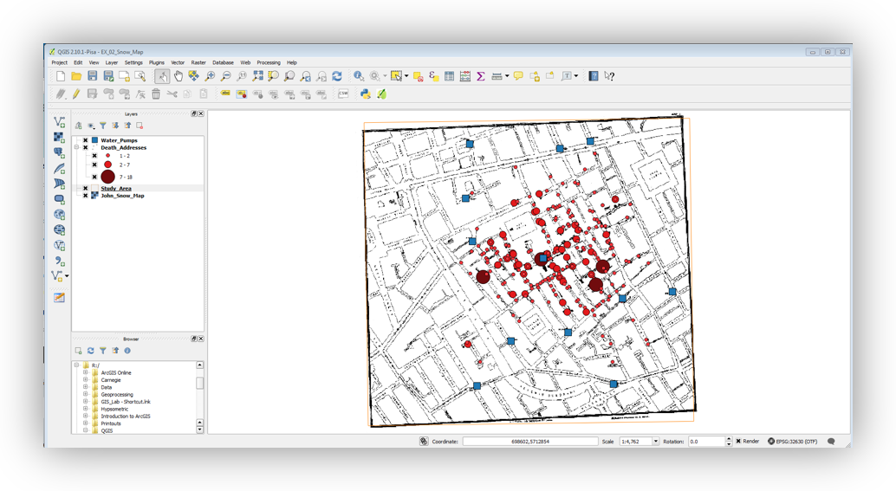  

Exploring the Data
------------------

Now we would like to get familiar with the data in this Map Document. Note that
there are five “Layers” in the Layers Window:

1.  **Water Pumps** – A point feature class of the locations of Water Pumps in
    John Snow’s map of the 1854 outbreak. The Name field was derived through a
    process called “Reverse Geocoding” where the points were referenced to a
    street network and the nearest valid street address was extracted. We will
    use these addresses as the name of the pumps.

2.  **Death Addresses** – Another point feature class of the locations of
    addresses at which deaths took place. Again, the address data in the
    attribute table was derived through “reverse geocoding.” The Num_Cases field
    gives the number of deaths at each location.

3.  **Study Area** – A polygon feature class that describes the extent of our
    study area. We use this in the Environment Settings of Geoprocessing Tools
    to control the extent of processes.

4.  **John_Snow_Map** – A scanned and georeferenced copy of John Snow’s map of
    the Cholera Outbreak of 1854. Each bar represents a death at that address.

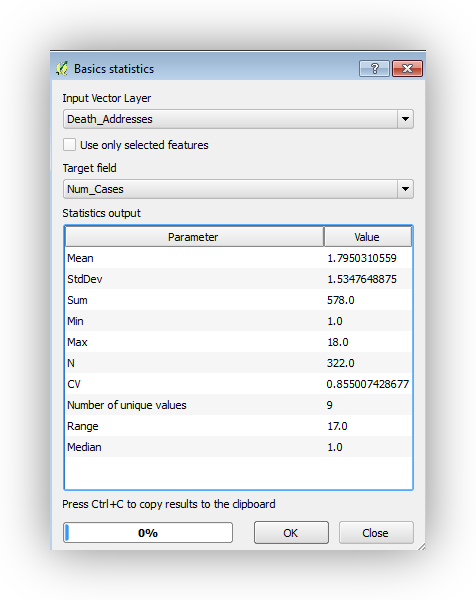

Getting Statistics on a Field

As mentioned, above, the **Num_Cases** field in the Death Addresses data
indicates the number of deaths at each address in the dataset. You can get a
simple statistical snapshot of the variable from the Attribute Table.

1.  On the pull-down menu go to **Vector \> Analysis Tools \> Basic Statistics**

2.  On the window select **Death Addresses**

    as the Input Vector layer and **Num_Cases** as the Target field.

3.  **Click OK** and **Close** after you finish your Exploratory Spatial Data
    Analysis (EDA). To find more about EDA go to
    [wiki.gis.com](http://wiki.gis.com/wiki/index.php/Exploratory_data_analysis)

Voronoi (Thiessen) polygon (Spatial Allocation)
-----------------------------------------------

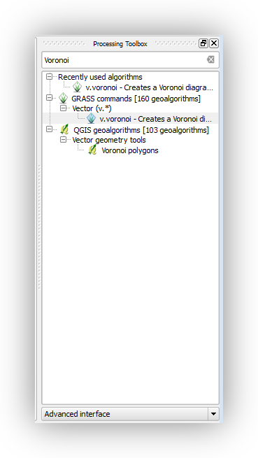

Thiessen polygons allocate space in an area of interest to a single feature per
polygon. That is, within a Thiessen polygon, all other features are closer to
the point that was used to generate that polygon than to any other point in the
feature set. In this case, we will create a set of Thiessen polygons based upon
the locations of the Water Pumps in our project.

1.  On the pull-down menu go to menu go to **Processing \> Toolbox**

2.  Go to the **Processing Toolbox Window** and change the view from
    **Simplified Interface** to **Advanced Interface.**

3.  Search for **Voronoi.**

4.  **Double –click** the **v.voronoi** tool under **Grass commands.**

5.  On the v.voronoi tool window input the select **Water Pumps** as the **Input
    points layer.**

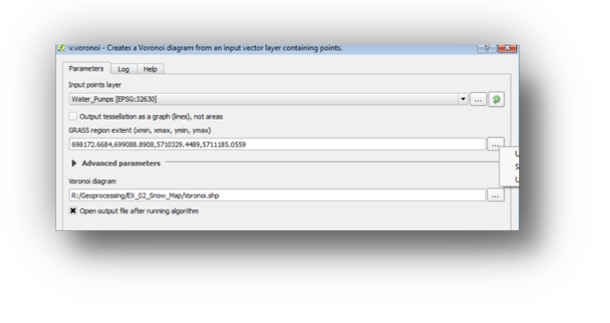

On **Grass region, click the 3 dots** and select **Use layer/canvas extent.**

1.  On the **Select extent window,** scroll down to find **Study Area.**

2.  **Click OK**

3.  **Click the 3 dots** besides the Voronoi diagram option, and **select Save
    to file.**

4.  Browse for the **EX_02_Snow_Map folder** and **save** the shapefile as
    **Water \_Pump_Voronoi.**

5.  **Click Run**

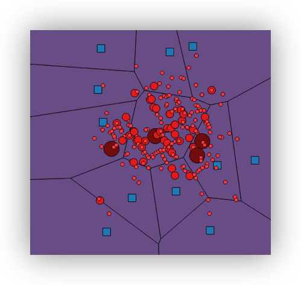

**Open** the Attribute Table of the **Water_Pump_Voronoi** to explore how each
Voronoi Polygon has the name of the pump enclosed.

###  Spatial Join (Point Aggregation)

Now that you have created the Thiessen polygon layer, you will “allocate” each
of the deaths to one of the Thiessen polygons. To do this, we will use the
**Spatial Join** tool.

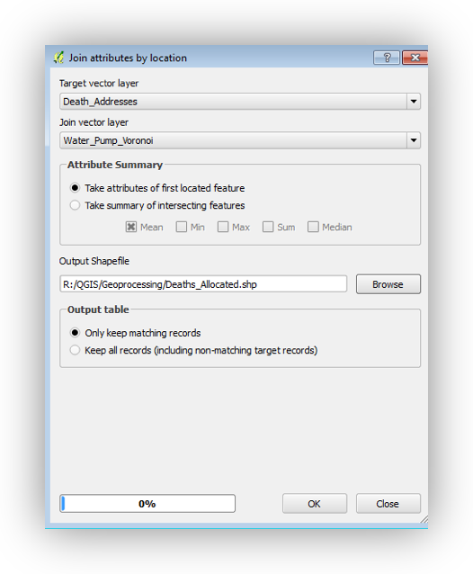

On the pull-down menu go to menu go to **Vector \> Data Management Tools \> Join
attributes by location**

1.  Select **Death Addresses** as the Target vector layer and
    **Water_Pump_Voronoi** as the Join vector layer.

2.  **Click Browse** to save the **Output Shapefile** as **Deaths_Allocated** in
    your **Data** Folder.

3.  **Click OK**

4.  Click **Yes** to add the new layer to the TOC (Table of Contents) and Close
    the Join the attributes by location window.

5.  The resulting layer is added to the Map Canvas. **Open** its **attribute
    table** to confirm that the attributes of the Water Pumps have been
    transferred (Hint: OBJECT ID_2, Name).

### Summary Statistics

Finally, we would like to summarize the deaths in the outbreak, grouping our
summary by the name of the Water Pump that each Death Address is nearest.

1.  On the pull-down menu go to **Plugins\> Manage and install plugins.**

2.  On the Plugins window search, type **Group Stats** and select it.

3.  Click on **Install plugin.**

4.  Close the **Plugin Window.**

>   After the installation a **GroupStats Tool** appears on the Vector Toolbar.

1.  **Click** the **Group Stats tool**

2.  **Select Deaths_Allocated** as Layer.

Dag from **Fields** to **Column**: average, count and sum. On **Rows,** drag
Name (originally from the Water_Pump data layer), and on **Value** drag
**Num_Cases.**

1.  **Click** on **Calculate** to visualize the summary table.

2.  **Click** the Sum field header on the resulting table to **Sort descending**
    on the **SUM_Num_Cases** field.

Note that the **Broadwick Pump** has the highest value for two of three
significant attributes: **Count** (No. of households), **Sum** (Total Deaths),
and **Average** (Mean Deaths per Household).

1.  On the **Group Stats Window,** go the **Data\> Save all to CSV file. Save**
    the **Ouput Table** to your **Data** Folder and name it
    **Deaths_Summary_by_Pumps**.

2.  **Close** the Group Stats Window

Spatial Central Tendency
------------------------

### Spatial Mean (Mean Center) “The [mean center](https://desktop.arcgis.com/en/arcmap/latest/tools/spatial-statistics-toolbox/h-how-mean-center-spatial-statistics-works.htm) is the average x- and y-coordinate of all the features in the study area. It's useful for tracking changes in the distribution or for comparing the distributions of different types of feature”

 

On the pull-down menu go to menu go to **Vector \> Analysis \> Mean
coordinate(s)**

1.  Select **Death Addresses** as the Input vector layer.

2.  Leave the **Weight field** and **Unique ID field** as **Optional.**

3.  **Click Browse** to **save** the Output Shapefile as:
    **Deaths_Spatial_Mean** to the **Data** Folder**.**

4.  **Click OK** to calculate the **Mean Center** and **Close**.

5.  Change the **Symbology** for the **Deaths_Spatial_Mean layer** to something
    that contrasts with the other symbologies.

### Weighted Spatial Mean

1.  **Run** the **Mean Center tool** again, this time assigning the
    **Num_Cases** field as the **Weight Field**.

2.  **Save** the **Output Shapefile** to the **Data** folder and name it
    **Deaths_Weighted_Spatial_Mean**.

3.  **Apply a symbology** to the **Deaths_Weighted_Spatial_Mean layer**.

### Standard Distance

On the pull-down menu go to menu go to **Processing \> Toolbox** to open the
**Processing Toolbox Window.**

On the **Processing Toolbox Window type** to **search**: **Spatial point pattern
analysis** and **double click** to open the tool window.

1.  Select **Death Addresses** as the **Point** layer.

2.  Click the 3 dots and **Select** Save to a file.

3.  **Give** an appropriate name and **Save** the **3 Output Files** on your
    **Data** folder.

**Click Run** to calculate the **Standard Distance, Mean Centre and Bounding
Box.**

>   The red dot is the mean center (no weight field; the large circle is the
>   standard distance, which gives an indication of how closely the points are
>   distributed around the mean center; and the rectangle is the bounding box,
>   describing the smallest possible rectangle which will still enclose all the
>   points.

Creating a surface from Point Data to Highlight “Hotspots” 
===========================================================

Kernel Density

The Kernel Density Tool calculates a magnitude per unit area from the point
features using a kernel function to fit a smoothly tapered surface to each
point. The result is a raster dataset which can reveal “hotspots” in the array
of point data.

1.  Go to the **Processing Toolbox Window** and **type** to search **Kernel
    Density Estimation (SAGA)** and **double click** to open the tool window.

2.  **Select** the **Deaths_Allocated** layer as the **Points** features.

3.  Select **Num_Cases** as the **Weight Field.**

4.  Set the **Radius** option to **50** (this is in meters).

5.  On the **Output Extent** option, click the 3 dots and select **Use
    layer/canvas extent.**

6.  On the resulting window search for **Study Area** and **Click OK.**

Set the **Cellsize** to 10 (this is also in meters)

1.  On the **Kernel Option click** the 3 dots and select **Save to File.**

2.  **Save** the **Output Raster** to the **Data Folder** as **Kernel_Density.**

3.  **Click Run** to run the Kernel Density tool.

4.  **Right Click** the **Kernel_Density layer** and **open** its
    **properties**.

**Go** to the **Style Tab** and select

1.  **Render Type:** Singleband gray

    1.  **Color Gradient:** White to black

    2.  **Contrast enhancement:** Stretch to MinMax.

    3.  **Load min/max values:** Select min/max and click load.

    4.  **Hue:** Check Colorize and select a color of your choice

    5.  **Resampling:** Zoomed in **Bilinear.**

    6.  **Click OK**

  
Exercise 2: Areal Interpolation of Attributes

In this tutorial, we will be performing what is referred to as “Areal
Interpolation” of Census Attributes. We have a set of boundaries (in this case
the Major Watershed Basins of Connecticut, our CT_Major_Basins Layer) for which
we would like to summarize the population. Our problem is that these watershed
boundaries do not correspond with the geographic units that the U.S. Census uses
to collect and tabulate demographic data. Some of the Census Block Groups in our
CT_Block_Groups layer overlaps more than one Watershed basin unit. What we will
do in the following steps is to calculate the proportion of overlap for each
Census Block Group, relative to the Watershed Boundaries, and use these
proportions to assign an appropriate estimate of the population to each
watershed.

1.  On the pull-down menu go to **Project\>New** to create a new empty Map
    Canvas

2.  Immediately **save** the blank document as **EX_03_Areal_Interp.qgs** to the
    **Geoprocessing\\EX_03_Areal_Interp** folder so that it becomes the
    **Project home** folder.

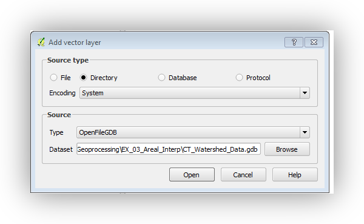

Adding Layers From a Geodatabase

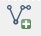

1.  **Click** the **add vector layer icon**

2.  On the resulting window select **Directory**

    and **OpenFileGDB** as the Type.

3.  **Click Browse.**

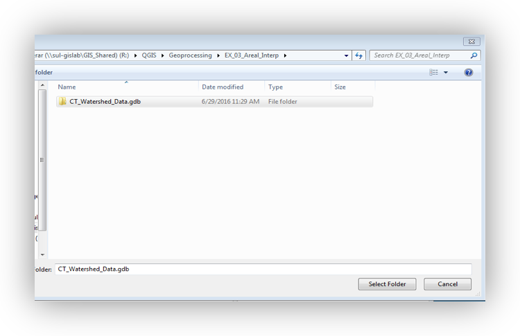

On the resulting window go to the **EX_03_Areal_Interp folder** and **Select
(**do not open) the **CT_Watershed_Data.gdb** and **click Select Folder.**

1.  Back on the Add vector layer window **click Open.**

2.  On the resulting window, (Select vector layers to add), use **Ctrl** to
    select the following layers:

    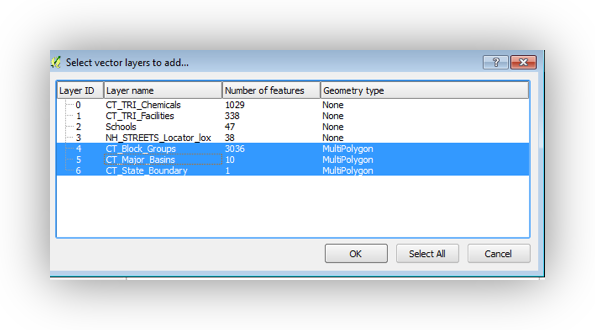

    1.  **CT_State_Boundary**

    2.  **CT_Block_Groups**

    3.  **CT_Major_Basins**

3.  **Click OK**

4.  **Change** the order of the layers on the Layers window, so the order of
    visibility is CT_Major Basins is first, CT_Block_Groups, CT_Major Basins.

5.  **Double click** on the **color patch** for the **CT_Major_Basins layer** in
    the **Layers Window** to open the layer properties, style tab. Select
    **Simple Fill \> Transparent Fill** and **Blue** as the **Border** Color and
    change the **Border width** to 1.0. **Click OK.**

    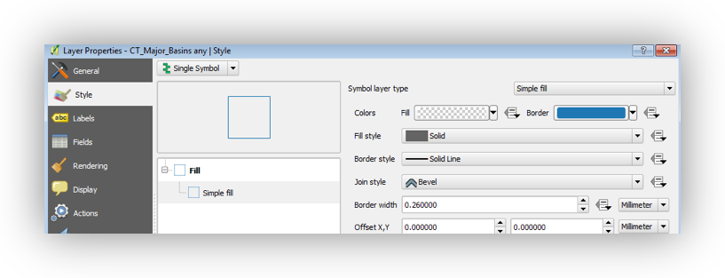

## Calculating Geometry for a Data Layer

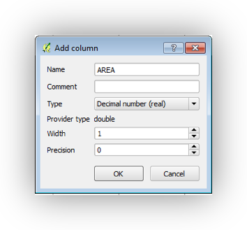

First, we need to determine the initial area of each of our “intact” Census
Block Groups. We can refer to these as the “**Parent**” features. To enable the
edit tool, first we need to save the CT_Block_Group Layer from the Geodatabase
as a shapefile.

1.  **Right-Click** on the **CT_Block_Group Layer** and select **save as**.

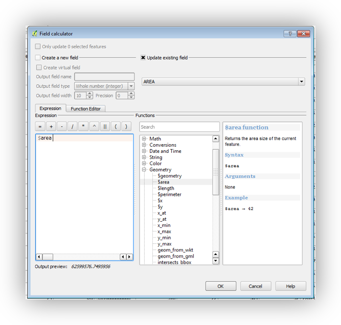

**Browse** for the **EX_03_Areal_Interp folder** and save the new shapefile as
CT_Block_Group_Edit.

1.  **Open** the **Attribute Table** and take a few seconds to **examine the
    data** available in this dataset. This data describes the demographic
    characteristics of every Census Block Group in our area of interest.

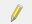

At the top of the Attribute Table, **click** the **Toggle editing mode tool** or
press Ctrl + E

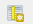

At the top of the Attribute Table, **click the New Column tool** or press Ctrl+W

1.  On the resulting window set the parameters to: **Name = AREA**, and **Type =
    Decimal number(real)**, **Width= 10,** and **Precision = 0**

2.  **Click OK**.

3.  **Scroll** to the **far right** of the **Attribute Table** to view the newly
    added **AREA Field**.

**Click** the **Field Calculator tool** or press Ctrl+I

1.  **Check: Update existing field** and scroll down the Object Id to find the
    **Area Field.** Under functions **expand Geometry** and **double click** on
    **\$area** to select the function.

2.  **Click OK.**

>   Note that the AREA Field should now be populated with the new values, in
>   square meters, because the coordinate system is in meters.

**Save** the Edits on the Attribute Table ( or Ctrl+S) and stop the editing mode
by clicking the **Toggle editing tool**

Geoprocessing: Using the Union Tool
-----------------------------------

Now, we need to **merge the Block Group and Watershed boundary files**, so that
those Block Groups that span more than one watershed will be split into their
sub-units of overlap, or “**child**” features. To do this, we will use a
technique generically referred to as “Geoprocessing.” Geoprocessing is the act
of applying any number of spatially transforming tools to a dataset. In this
case, we will use the Union Tool to create a new dataset.

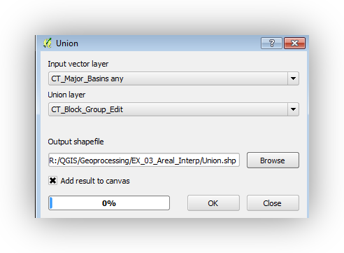

On the pull down-menu go to **Vector \> Geoprocessing Tools \>Union**

1.  **Select** the **CT_Major_Basins** as the Input vector layer and
    **CT_Block_Group_Edit** as the Union Layer.

2.  **Click** on **Browse** to **save** the **Output Shapefile** to your
    **EX_03_Areal_Interp folder** and name it “**Union**”

3.  **Click OK** (…and BE PATIENT!)

4.  **Click Close** once the process has completed.

5.  You should be left with a new Union Layer, at the top of your Layers window.

Calculating the New Area of the Union Results
---------------------------------------------

Now we need to calculate the NEW AREA of those “Child” Block Groups that were
split by the Union Process and then the proportion of their original AREA. Use
the same method you used previously to calculate the Parent Area of the Census
Block Groups.

1.  **Right-Click** on the **Union Layer** and **Open the Attribute Table**.

2.  **Click** on the **Toggle editing mode** and…

3.  Add a new column: **Name = SUBAREA**, **Type = Decimal number (real),
    Width=10, Precision =0**. **Click OK**.

4.  Add a new column: **Name = WEIGHT**, **Type = Decimal number (real),
    Width=10, Precision =0**. **Click OK**.

5.  Add a new column: **Name = WTPOP**, **Type = Whole number (integer),
    Width=10, Click OK**.

6.  **Click** on the **Field calculator tool** and **check** the **update
    existing field.**

7.  **Scroll down** to the newly added **SUBAREA Field**.

8.  **Expand** the **Geometry** function and **double click \$area** to add it
    to the expression.

9.  **Click OK** to **apply** the **calculation**.

Calculating the Weight value
----------------------------

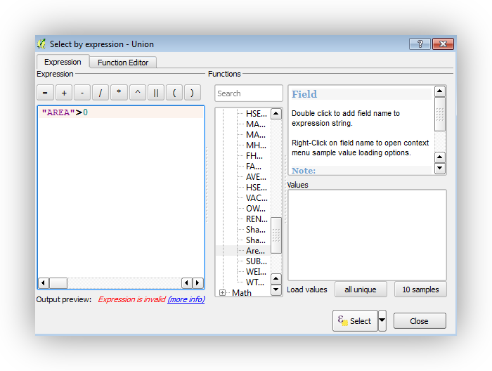

Now we will calculate the proportion of the child area to parent area, which
will be used as a weight to apply to the demographics we are interested in.
**First, we must exclude those polygons that have an AREA=’0’ (these are coastal
“slivers” and are not important to the results of our analysis).**

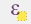

On the Union Layer Attribute Table, **click** on the **Select features using
expression tool**

1.  In the **Select by Expression** window write the expression:  
    **"AREA" \>0**

    This will select only those records that do not have an AREA = 0.

2.  **Click Select**.

3.  **Click Close**.

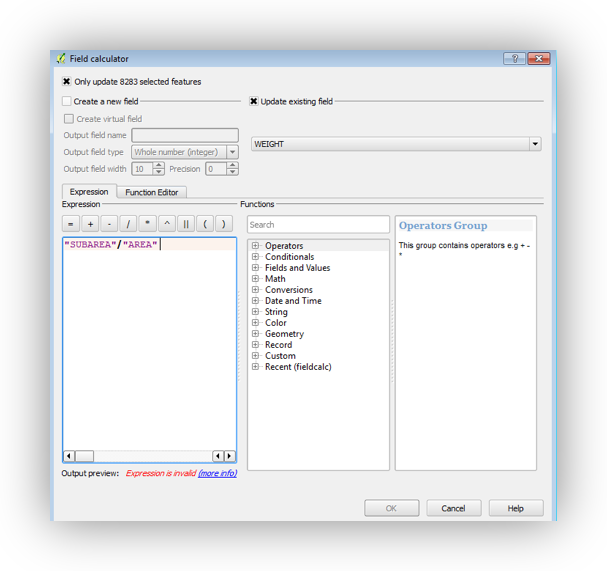

**Open** the **Field Calculator.**

1.  **Check** the **Only update 8283 selected feature** option. *The calculation
    will only be applied to the selected subset of records, thus avoiding a
    “divide by 0” error.*

2.  **Check** the **Update existing field** and scroll down for the **WEIGHT
    field**.

3.  **Build** the following expression: **"SUBAREA" / "AREA"**

4.  **Click OK**

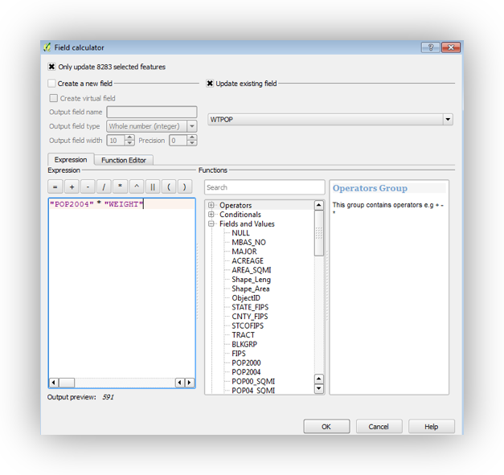

Finally, **Open** the **Field Calculator** and calculate the **WTPOP** field,
using the following argument:  
**“POP2004” \* “WEIGHT”**  

1.  **Click OK** to **apply** the Calculation.

**Save** your edits ( or Ctrl+S) and **Stop** the **Toggle editing mode** by
**clicking** the **Toggle editing tool** Ctrl+E.

Summary Statistics
------------------

Now that we have a set of Census Boundary files that correspond to the
watershed, and estimates of the population of those new boundary units, we need
to summarize those population estimates for each of our watershed units. We will
do this by running the Summary Stats tool on our Union Dataset, using the
**Major field** (which identifies the Major Basin or watershed each polygon is
in) as the **Case Field**.

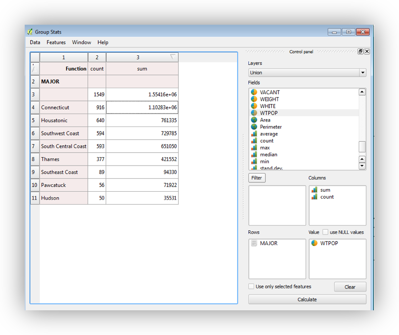

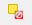

On the **Attribute Table** click on the **Clear Selection** button

**Search** for and **open** the **Group Stats tool**

1.  **Select** the **Union** as the **Input Layer**.

2.  **Drag Major** to **Rows, Sum and Count** to **Columns** and **WTPOP** to
    **Value**.

3.  **Click Calculate.**

4.  Go to **Data \> Save all to CSV file and Save** the resulting table to the
    **EX_03_Areal_Interp** folder as **Population_Summary**

5.  **Close** the **Group Stats** window.

**Click** on the **Add delimited text tool**

1.  On the resulting window **Click Browse** and locate the **Population
    \_Summary Table**. **Select** it and **Click Open**

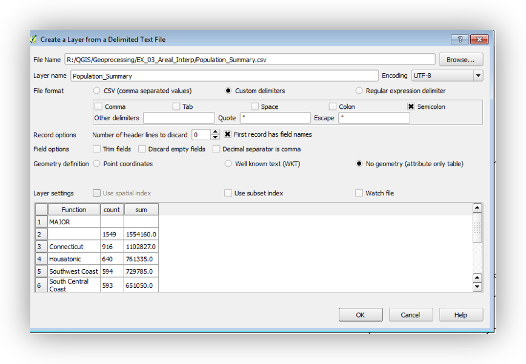

**Select:**

>   **File format:** Custom delimiter, **Check** the semicolon option, **Check**
>   First record has field names and **No Geometry** as Geometry definition**.**

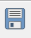

**Click OK**.

1.  **Save** your work

Exercise 3: Leveraging Relational Database Capabilities in QGIS
===============================================================

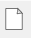

Creating a new Map Document

1.  First, **Click** on the **New button** on the **File Toolbar**, at the top
    of QGIS.

2.  Go to **Project\>Project Properties\>CRS** and set the **Project Coordinate
    System** as *EPSG: 102656 NAD_1983_StatePlane_Connecticut_FIOS_0600_Feet*

3.  **Save** the **New Map Document** to the
    **\\Geoprocessing\\EX_03_Areal_Interp folder** as **EX_04.qgs**

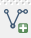

Add a Dataset to the Map Document

1.  **Click** on the **Add vector layer button** and add the **CT_State_Boundary
    polygon,** the **CT_TRI_Chemicals** and the **CT_TRI_Facilities** from the
    **CT_Watershed_Date.gdb into** the **Layer** window.

Creating a Feature Class from a Table of XY Coordinates
-------------------------------------------------------

1.  **Right-Click** and **Open** the **CT_TRI_Facilities** table and examine the
    data. Note the **Latitude** and **Longitude** fields.

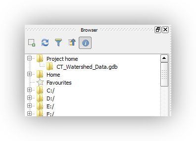

**Close** the **CT_TRI_Facilities** table.

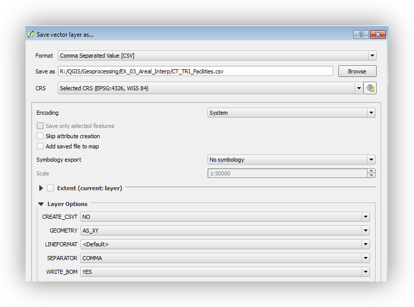

>   Right now, all the data is inside an ESRI Geodatabase. To be able to
>   visualize the **CT_TRI_Facilities table** as an XY point layer, we need to
>   export the table into a new CSV file, outside the **CT_Watershed_Date.gdb**.

1.  **Right-Click** on the **CT_TRI_Facilities** and select **save as**.

2.  **Select Comma Separated Value (CSV)** as the **Format.**

3.  **Browse** for the **EX_03_Areal_Interp folder** and save the new file as
    **CT_TRI_Facilities_CSV.**

**Uncheck** the **Add saved file to map** option and leave everything else as
default.

1.  **Click OK**

    If you go to the **Project home** folder, on the **Browser** window, you
    should now be able to see the CT_TRI_Facilities_CSV listed.

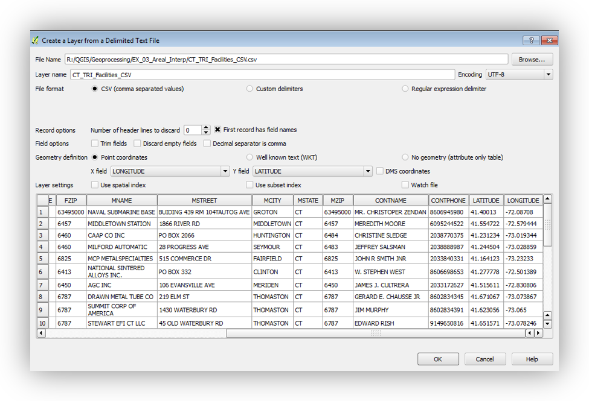

**Click** on the **Add delimited text layer button** and browse for the the
**CT_TRI_Facilities_CSV** file and select the following parameters :

>   **File format** = **CSV (comma … values)**

>   **Geometry definition = Point Coordinates**

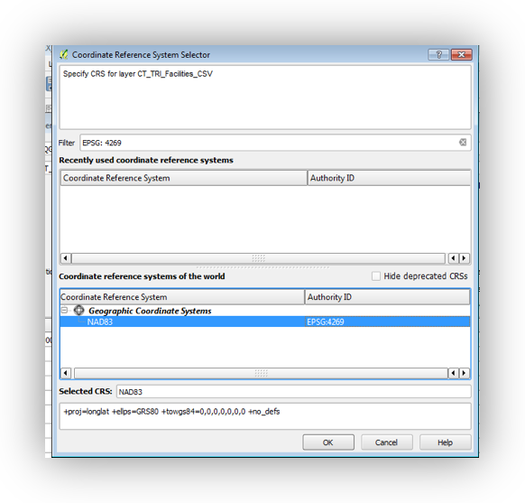

**X field= LONGITUDE**

**Y field = LATITUDE**

1.  **Click OK**.

On the resulting CRS Selector window **Type EPSG: 4269** to filter and
**Select** the *NAD83 Geographic Projection*

1.  **Click OK**

2.  **Right-click** the **CT_TRI_Facilities** table and select **Remove**. A
    confirmation window will appear, **click OK.**

3.  **Right-click** the **CT_TRI_Facilities_CSV** point layer and **save** it as
    **Toxic_Sites** and as an **ESRI Shapefile Format** to the
    **EX_03_Areal_Interp** folder and **add saved file to map.**

4.  **Remove** the **CT_TRI_Facilities** csv and point layer from the map
    document.

Relationships Classes in the GDB
--------------------------------

1.  **Right click** on the **CT_TRI_Chemicals** table and **save** it as a Comma
    Separated Value (CSV) **Format into** the **EX_03_Areal_Interp folder.** The
    new file will be called **Chemicals. Add saved file to map.**

2.  **Remove** the CT_TRI_Chemicals table.

3.  On the pull-down menu go to **Project\>Project Properties\>Relations**

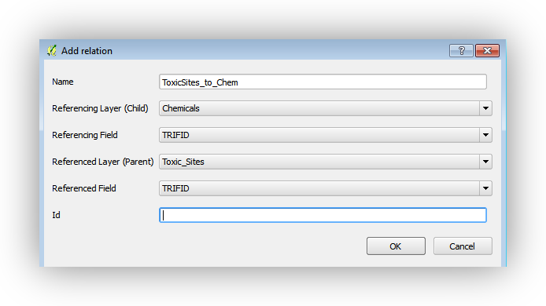

**Click** the **Add relation button**

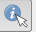

On the resulting **Add relation window** use the following settings**:**

1.  **Name = ToxicSites_to_Chem**

    1.  **Referencing Layer (Child) = Chemicals**

    2.  **Referencing Field= TRIFID**

    3.  **Referenced Layer (Parent) = Toxic_Sites**

    4.  **Referenced Field= TRIFID**

2.  **Click OK** twice to create the relation

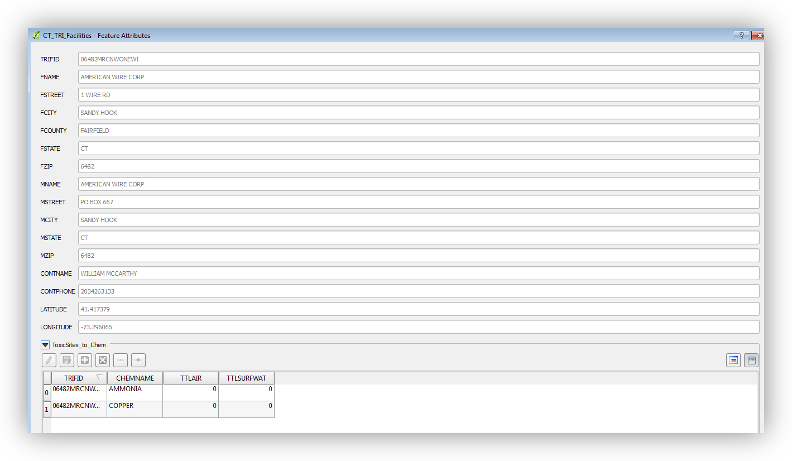

**Click** the **Identify Feature button** and **click** a point feature
(facility). You should see **CT_TRI_Facilities-Feature Attributes** window. Make
sure the **auto open form** is **checked.**

1.  **Click** on the **table view** to see a list of the chemicals being
    associated with that specific facility.

2.  **Save your map project! (Ctrl + S)**

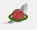

Creating a Geodatabase to Perform SQL 
--------------------------------------

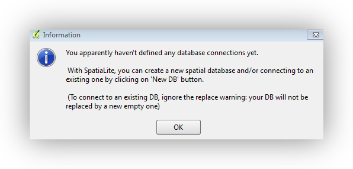

Go to **Plugins\>Manage and Install plugins…**

1.  Search and install **QSpatiaLite**. After the installation **click** on the
    tool to start the plugin.

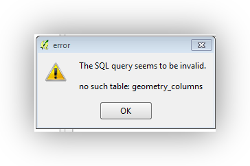

A window saying that they are not database connections yet should appear.
**Click OK.**

1.  **Save** the **NewDB** in the **EX_03_Areal_Interp** folder as
    **Toxic_Facilities.db**

    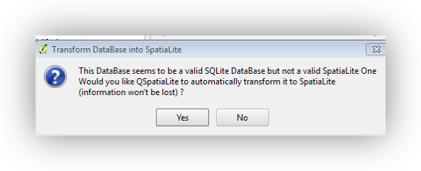

2.  An error window appears. **Click OK**

    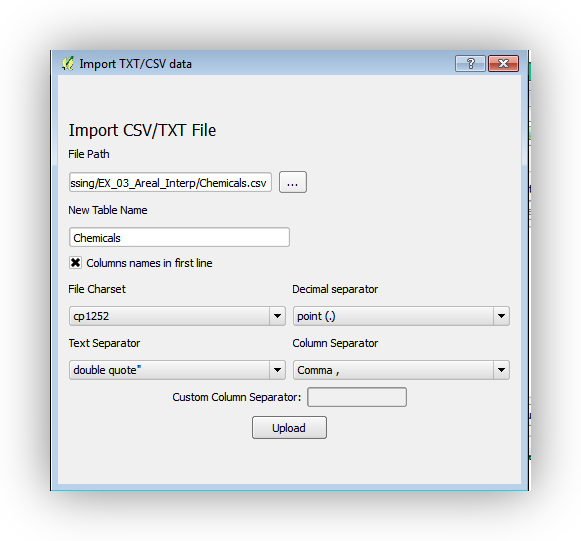

    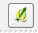

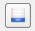

On the **QspatiaLite** window **select** the **Import QGIS Layers** tool and
**select Toxic_Sites. Click OK.**

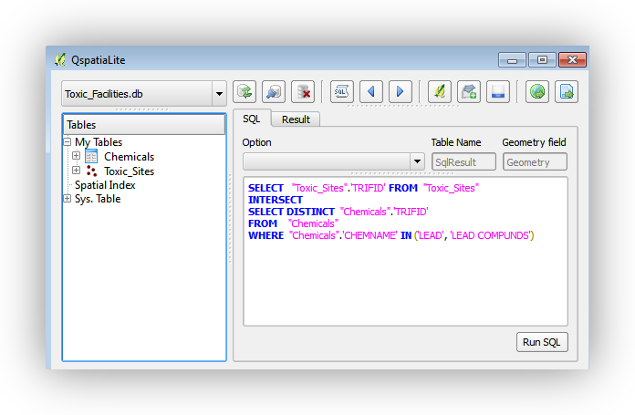

To import the **Chemicals** table use the **Import TXT_CSV** tool On the **File
Path**, **browse** to the **EX_03_Areal folder** to find the **Chemicals.csv**
and **set** the next options:

**New Table Name= Chemicals**

**Check = Columns names in first line**

**Column separator = Comma,**

**Click Upload.**

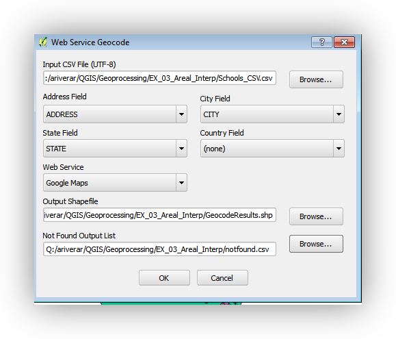

1.  To select the **Toxic_Sites** that release *Lead and Lead Compounds* into
    the environment,

    on the **SQL Tab** type the next expression:

    **SELECT** "Toxic_Sites".'TRIFID' **FROM** "Toxic_Sites"

    **INTERSECT**

    **SELECT DISTINCT** "Chemicals".'TRIFID'

    **FROM** "Chemicals"

    **WHERE** "Chemicals".'CHEMNAME' **IN** ('LEAD', 'LEAD COMPUNDS')

2.  Click **Run SQL**

### Geocode the Address Data

1.  **Add** the **Schools table** from the **CT_Watershed_Data.gdb** into the
    **Map Document.**

2.  **Right-Click** on the **Schools** table and **save** it as a **CSV** table
    on the **EX_03_Areal_Interp folder** as **Schools_CSV**

3.  On the pull-down menu **go** to **Plugins\>Manage and Install Plugins.**

4.  **Search** for **MMQGIS** and **install** the plugin.

    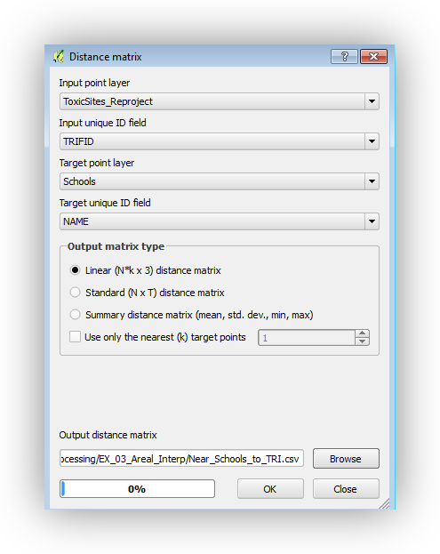

5.  **MMQGIS** should appear on the pull-down menu.

6.  **Go** to **MMQGIS\>Geocode\>Geocode CSV with Google/OpenStreet…**

7.  On the **Web Service Geocode Window** set the **Schools_CSV** as the **Input
    CSV File.**

8.  **Save** the **Output Shapefile** as **GeocodeResults** and the **Not Found
    Outpust List** as **notfound.CSV** on the **EX_03_Areal_Interp folder**.

9.  **Click OK**

10. **Remove** the Schools tables and **Save** map document**.**

Finding the Nearest Features (Distance Matrix)
----------------------------------------------

The **Distance Matrix** tool will be used to create a table that identifies the
**facilities within 5 miles** of each **school.**

1.  **Save** the **GeocodeResults** shapefile as **Schools** using the **Project
    CRS (EPSG:102656 – NAD_1983_StatePlane_Connecticut_FIPS_0600_Feet). Remove**
    the GeocodeResults layer.

2.  **Save** the **Toxic_Sites** shapefile as **ToxicSites_Reproject** using the
    **Project CRS (EPSG: 102656 –
    NAD_1983_StatePlane_Connecticut_FIPS_0600_Feet). Remove** the Toxic_Sites
    layer.

3.  Go to **Vector\>Analysis Tools\>Distance Matrix.**

On the Distance Matrix window, set the following parameters:

>   **Input point layer = ToxicSites_Reproject**

>   **Input unique ID field = TRIFID**

>   **Target point layer = Schools**

>   **Target unique ID field = Name**

>   **Output matrix type = Linear**

1.  **Save** the Output table to the **EX_03_Areal_Interp folder** as
    **NEAR_Schools_to_TRI**

2.  **Click OK** to run the tool.

3.  **Add** the resulting table to the **layers window.**

4.  **Save** the table as a CSV format: **Schools_Distance_Toxic** and **add**
    the saved file to map.

5.  **Right-Click** and **Open** the **Schools_Distance_Toxic** table and
    examine the data. Note the **Distance** field uses feet as the linear
    measure.

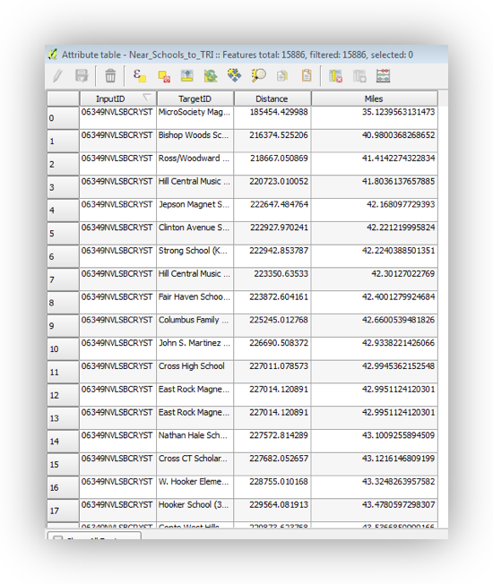

1.  **Click** on the **Open Field Calculator** and set the following parameters:

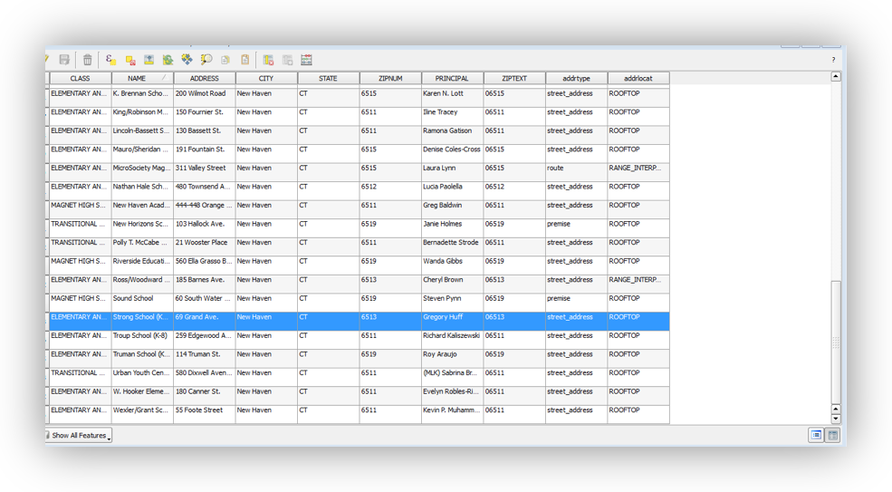

>   **Output field name = Miles**

>   **Output field type = Decimal number (double)**

>   **Expression = "Distance" \*.000189394**

1.  **Perform** a **Select by Expression** where **Distance \< 5.0** and **save
    the selection as Schools2Near**

Relationship Classes in the Map Document
----------------------------------------

### CHEMICALS to NEAR Table

1.  Go to **Project \> Project Properties\>Relations** to **add a relation.**

**Name = Chem_to_Near**

**Referencing Layer (Child) = Chemicals**

**Referencing Field= TRIFID**

**Referenced Layer (Parent) = Schools2Near**

**Referenced Field= InputID**

### TOXIC SITES to the NEAR Table

1.  Go to **Project \> Project Properties\>Relations** to **add a relation.**

**Name = ToxicSites_to_NearSchools**

**Referencing Layer (Child) = Schools2Near**

**Referencing Field= InputID**

**Referenced Layer (Parent) = ToxicSites_Reprojected**

**Referenced Field= TRIFID**

### Schools to the NEAR Table

1.  Go to **Project \> Project Properties\>Relations** to **add a relation.**

**Name = Schools_to_NearSchools**

**Referencing Layer (Child) = Schools2Near**

**Referencing Field= TargetID**

**Referenced Layer (Parent) = Schools**

**Referenced Field= Name**

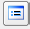

Exploring Related Tables

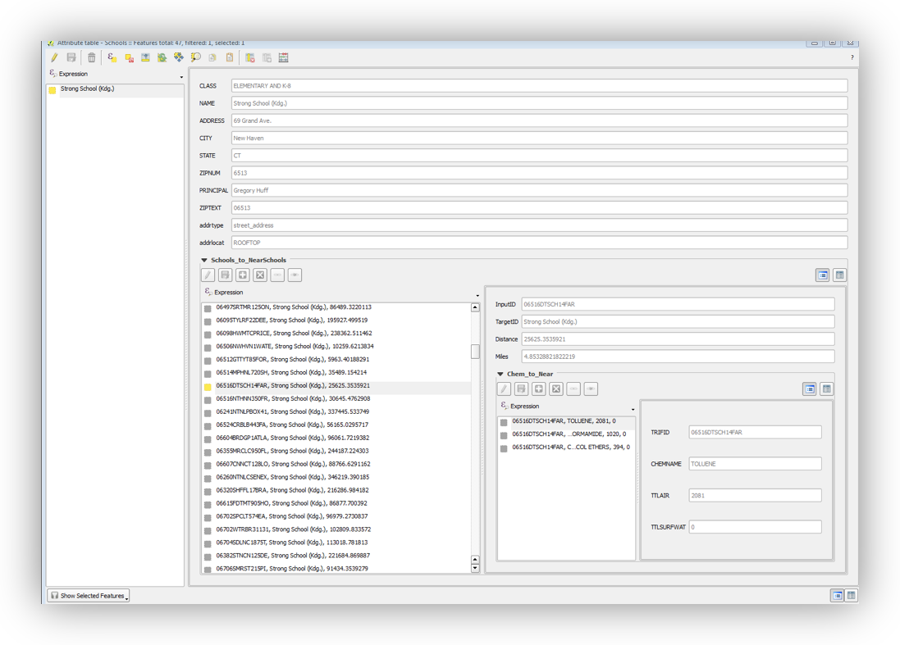

**Open** the **Schools** attribute table and Select **The Strong School** (using
any method of selection you prefer).

1.  **Switch** to **Form View**

2.  **In the Schools** table that are related to the record for the **Strong
    School**.

3.  From the now opened **Schools table,** using the **Form View, select** in
    the **Schools2Near** table, shows the Toxic Sites and distance to the Strong
    School.

4.  Now, from the **Schools2Near**, use the **Form View** to **select** the
    records in the **Chemicals table** that are related to the TRI Sites.

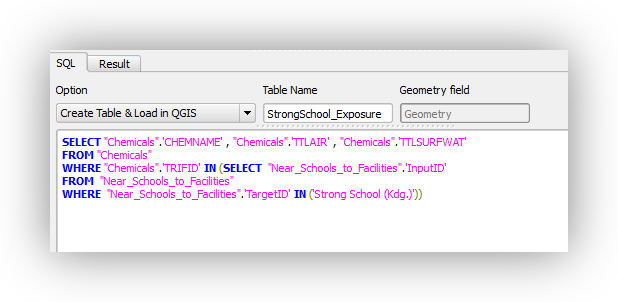

Performing SQL 
---------------

1.  On the **QspatiaLite** window **select** the **Import QGIS Layers** tool and
    **select Schools.**

    

2.  To import the **Near_Schools** table use the **Import TXT_CSV** tool On the
    **File Path**, **browse** to the **EX_03_Areal folder** to find the
    **Schools2Near.csv** and **set** the next options:

    **New Table Name= Near_Schools_to_Facilities**

    **Check = Columns names in first line**

    **Column separator = Comma**

    **Click Upload.**

3.  On the SQL Window type:

    **Set** the Option as **Create Table & Load in QGIS** and **Name** as
    StrongSchool_Exposure

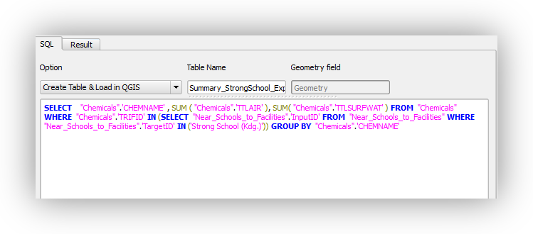

>   **SELECT** "Chemicals".'CHEMNAME' , "Chemicals".'TTLAIR' ,
>   "Chemicals".'TTLSURFWAT'

>   **FROM** "Chemicals"

>   **WHERE** "Chemicals".'TRIFID' **IN** (**SELECT**
>   "Near_Schools_to_Facilities".'InputID'

>   **FROM** "Near_Schools_to_Facilities"

>   **WHERE** "Near_Schools_to_Facilities".'TargetID' **IN** ('Strong School
>   (Kdg.)'))

*The selection of chemical records you have created represents the compounds
being released with 5 miles of the Strong School.*

### Summary Statistics

Finally, we would like to summarize these compounds, since we have, for
instance, many records of Lead Compounds selected, we would like a single record
that indicates the TOTAL amount of Lead compounds released within 5 miles of The
Strong School, and so on…

**On the SQL** Window add to what you typed: **GROUP BY** "Chemicals".'CHEMNAME'

1.  **Name** the **Output Table Summary_StrongSchool_Exposure** and **load** it
    to QGIS.

2.  **Open** the resulting **Summary Table** and examine the results

This concludes the Geoprocessing Tutorial
