# QGIS 101
https://mapninja.github.io/QGIS-101/


Stacey Maples – Geospatial Manager – Stanford Geospatial Center – stacemaples@stanford.edu

David Medeiros – GIS Instruction & Support Specialist - Stanford Geospatial Center - davidmed@stanford.edu

## Overview

This workshop aims to accomplish two things: Introduce participants to basic vocabulary, concepts and techniques for working with spatial data in research and introduce the interface and tools in QGIS, a free & open source desktop GIS software. This introductory session will focus upon the fundamental concepts and skills needed to begin using Geographic Information Systems software for the exploration and analysis of spatial data using the QGIS platform.  

Topics will include:  

* What is GIS?
* Spatial Data Models and Formats
* Projections and Coordinate Systems
* Basic Data Management
* The QGIS User Interface
* Simple Analysis using Visualization.

### GIS Resource links:  

Stanford Geospatial Center website - http://gis.stanford.edu/

Stanford Geospatial Center Slack - https://stanford-geospatial.slack.com

Stanford GIS Listserv - https://mailman.stanford.edu/mailman/listinfo/stanfordgis

QGIS Current Version Download - https://qgis.org

QGIS Current Version Help - https://qgis.org/en/docs/index.html

This tutorial on GIthub Pages - https://mapninja.github.io/QGIS-101/

Introductory Slides: https://slides.com/staceymaples/gisintro-1/

LIVE Intro Slides: https://slides.com/staceymaples/gisintro-1/live

Steven Johnson's "Ghost Map" TED Talk - https://www.ted.com/talks/steven_johnson_how_the_ghost_map_helped_end_a_killer_disease

## Setup

Users should prepare for this workshop by installing the QGIS software appropriate for their operating system and downloading the data to their local hard drive.

### Software

This workshop was created using QGIS version 3.12, which is the long-term release. If you are in new user we suggest installing the latest long-term release for your operating system. While the latest beta release contains extra features and functionality, it often and also contains bugs and limited functionality, which can be frustrating to new users.

To download QGIS for your operating system go to QGIS.org and click on the download link.

[https://qgis.org/en/site/forusers/download.html](https://qgis.org/en/site/forusers/download.html)

### Data

1. The data package for the workshop can be downloaded from [https://github.com/mapninja/QGIS-101/archive/master.zip](https://github.com/mapninja/QGIS-101/archive/master.zip)
2. Once the download is complete, browse to the folder where you saved it, and unzip the .zip file to make it's contents completely accessible to QGIS. 

The project data folder contains the following datasets:

* **deathAddresses.csv**  - this is a table latitude and longitude coordinates for addresses affected by the cholera outbreak. This table also contains the number of deaths at each address.  
* **snow_map.png.tif** - this is a non-georeferenced image of the map from John Snow's original report on the cholera outbreak of 1854.
* **Study_Area.shp** - This file is simply a rectangular feature that describes our area of interest.  


#### Additional Files
There is an extra backup data folder that contains versions of files that we will create during the workshop. These files are provided in case any of the steps can't be completed due to software errors or other problems. Welcome to working with open source.  
* **Snow-cholera-map-1_modified** - this is a geo-referenced image of the map from John Snow's original report on the cholera outbreak of 1854.  
* **Water_Pumps.geojson** - this is a spatial data file containing the locations of all of the water pumps recorded in John Snow's original map of the cholera outbreak.  Who woo hoo

## Getting started on a project  

In this section we will cover starting a new QGIS project. We will create a new map document, go over the basic QGIS interface, customize that interface, add a plug-in and bring a base map into your QGIS project.

### Create a Map Document

1. To create a new map document, simply open QGIS and save 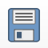    the resulting empty document to the top level of your project folder, naming your new document something meaningful like "SnowMap.qgz" or "Cholera_Map.qgz"

Notice that when you save your map document a new folder in your data browser panel appears. This folder is called **Project Home** and is a shortcut to the folder containing your map document. It's always a good idea to save your map document to a high-level folder above your data and other project directories.

### Interface overview

The QGIS interface is similar to many desktop GIS applications. The basic you GIS interface resembles most others GIS interfaces in that it uses a table of contents and data frame model for user interaction. In QGIS the **Table Of Contents** is referred to as the **Layers Panel** and the **Data Frame** is referred to as the **Map Canvas**.

#### The Basic Components of the QGIS Interface

The QGIS interface is made up of three basic components:

**The Map Canvas** – the map canvas is where your visualizations of data will show up when you had a new data layer. This is where you will view the changes that are made when you adjust symbology, when you change the order of layers, or when you produce a new data set through geo-processing  

**Tabbed Windows:**

* **The Browser Window** – Functions much as Explorer does in Windows. In this window, you can visualize your drives and folders. Is the equivalent of ArcCatalog in ArcMap.
* **The Layers Window** – This is where your added geographic and non-geographic datasets will show. This is similar to the Table of Contents in ArcMap.
* **Other Panels** - there are many other panels that it is possible to enable in the QGIS interface. We will be making use of the **Processing Toolbox** and **Layer Styling** panel for this workshop.

**Toolbars:**  
A number of  toolbars are enabled, by default, in a new installation  of QGIS. Below are the most commonly used, though not all of the defaults.  
* **Project** – Has the basic commands of any file: New, Open, Save, Save As. The New Print Composer and Composer Manager are to create and manage layout views.  
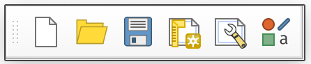
* **Map Navigation** – Allows the user to Pan, Zoom to a Selected Feature, Zoom In, Zoom Out, Zoom to previous/next extent, and Refresh.  
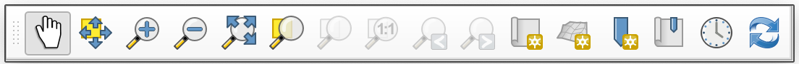
* **Attributes** – These tools allow the user to: Identify attributes, Select / Deselect features, Opens attribute table, measure distance/areas/angles, create spatial bookmarks.  
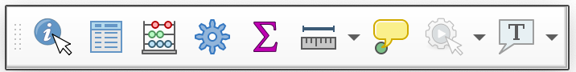
* **Data Source Manager** – This bar is to add layers (vector, raster, new shapefile layer)  
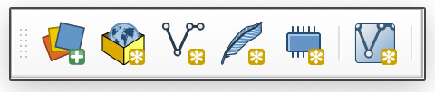
*  **Editing** - (Shown with editing toggled ON) Used for creating, altering and deleting features. Remains disabled, outside of an Edit Session.  
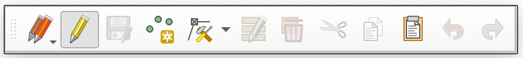  
* **Selection** -  Allows you to Select/Deselect features interactively, by attribute value, or by locations.  
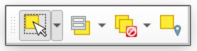
* **Plugins** – QGIS comes with one default plugin enabled: Python Console.  
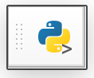
* **Help** – The question mark booklet is linked to the QGIS User Guide.  


### Customize the interface

When you first open QGIS, you might find the toolbars and panels that are enabled by default are more than your project calls for. Most panels and toolbars in the QGIS interface can be moved around by grabbing the title bar of panels, or the dotted handle on toolbars, and dragging them to the desired location in the interface. You can also use the View menu to turn panels and toobars on and off, as well as using a right-click anywhere in the toolbar area, to activate the context menu.


1. Toggle the visibility and move toolbars and panels until your QGIS interface resembles the image below.


## Add a plugin  
The first thing we would like to do is add a base map layer to our map project. We will use the **Quick Map Services** plug-in to add a base map created by [Stamen design](https://stamen.com/). QGIS uses a plug-in model to extend the functionality of the basic software. Most plug-ins are contributed by members of the QGIS community and many extend functionality by adding interactivity with external services like geocoding, routing, and base map services.

1. On the **Main menu** of **QGIS**, find the **Plugins** menu and open the **Manage and install plugins** dialogue.  
2. In the search box at the top of the dialogue, search for the term "QuickMapServices"    
3. The search should return a plug-in called "QuickMapServices."
4. Click on the QuickMapServices plug-in name and then click the install plug-in button
5. Once the plug-in has successfully installed, Close the plug-in management dialog.

  

### Add a basemap service layer

1. Installing the **QuickMapServices** plug-in should have added a new menu item to the **QGIS Main Menu** called "Web".
2. Click on the Web menu and from the **QuickMapServices** item select "**Settings**."
3. Select the "**More Services**" tab and click on the "**Get contributed pack**" button. This will download a large list of web map services that can be used directly into GIS as base maps.  


  


4. Once the contributed pack has been downloaded click **Save** to close the dialog.
5. Now return to the quick map services menu, and select the **Stamen> Stamen Toner Lite** base map.
6. **Save** your **map document**.


### Add an existing data layer
Now we're going to add an existing data layer. The data layer that we will add describes our **Area Of Interest** in this study. This layer will provide us with a convenient way to orient our data frame to the area that we are interested in, as well as providing a way to limit the processing extent of certain geo-processing tools.

1. In the **QGIS Browser panel**, find the data folder for this workshop (Hint: look for the "**Project Home**" folder) and double-click on the **study_area.shp** file, to add it to your **map project**.
2. In the **Layers panel**, right-click on the **study_area layer** and select "**Zoom to layer**."
3. On the **Main menu**, enable the **Layer styling panel** from the **View>Panels menu**.
4. In the **Layer styling panel**: select **Simple fill** from the panel at the top, and change the **Fill style** to "**No brush**." If you would like you can also change the **Stroke color** & **Stroke width** of the stroke to make it more visible against the black-and-white basemap.
5. **Save** your **map document**.


### Explore navigation tools

The **Map Navigation Toolbar** provides the bulk of the tools for navigation in the **Map Canvas**. Most of them are fairly obvious. Take a moment to explore each of these most popular tools:

  The **Pan Map** changes the Extent of Map Canvas, without changing the scale.
Click on the Pan Tool and use it to move around the Map Canvas.

  The **Pan Map to Selection** changes the Extent of your Map Canvas to the
feature being selected, without changing the scale

  The **Zoom In Tool** and    **Zoom Out** works exactly as you would expect. Click on the Zoom Tool, and drag
a box to enclose the Continental United States. You can also single-click with
this tool to use it as a Fixed Zoom Tools.

  The **Zoom Full** zooms you to the full extent of the layer in your Map Project with the largest spatial extent. This can sometimes be problematic if you are
working at a local level, but using one or more layers that are global in extent
(for example, many of the network base map services).

  The **Zoom to Selection** changes the Extent of your Map Canvas and zooms in or
out to the selected feature.

  The **Zoom to Layer** to a specific layer extent.

  The **Zoom Last** and  **Zoom Next** works as a Redo or Undo tool **ONLY** for the Scale/Extent in your Map Canvas. This tool is particularly useful if you change your Map Extent inadvertently.

  The **Refresh Button** will reload your Map Extent

### Scale

When zooming in or out, the **Scale Values** at the bottom of the page changes. Remember that the bigger the number (**1:60,000,000**), the larger the area being displayed. Although **60,000,000** is bigger than **60**, a scale **1:60,000,000** is a small scale and **1:60** is a large scale because the division of **1/60,000,000** is smaller than **1/60**. This difference is easy to remember when you consider that features in a large scale map are shown very large!


### Spatial Bookmarks

Often, we want to be able to move around in our data frame examining different parts of the map zooming in and out, and then returning to our primary area of interest. This can be easily accommodated through the use of spatial bookmarks. Here you'll create a spatial bookmark which allows us to quickly return to the area that we are interested in.

1. Previously we used the main menu to enable a panel. This time, try right-clicking in any empty area of the toolbar then scroll down and select the **Spatial Bookmarks panel** from the menu that is presented.
2. Right-click on your study_area layer and select **Zoom to layer**.
3. Click on the **Add Bookmark** button and rename the resulting Spatial Bookmark: "**SOHO**"  


4. Click on the **Zoom Full** button to zoom to the world, then use the **Zoom to bookmark ** button to return to your Area of Interest.

## Working with Coordinate Reference Systems (CRS)
Here we will examine the default **Coordinate Reference System**, which should currently be sent to **Web Mercator** and we will change it to **Universal Transverse Mercator** to match our study area layer.  

### Examine the CRS of a data layer
1. Right-click on the **study area** layer select the Layer Properties from the menu.
2. Click on the **Source** tab on the left side of the properties panel, and note in the section called **Geometry And Coordinate Reference System** that the CRS of this layer is:  

```EPSG:32630 WGS 84 / UTM zone 30N```  


3. Click OK to close the **Layer Properties** Dialog  
4. On the **Main Menu** Open the **Project>Project Properties**  
5. Click on the **CRS** tab at the left and note that the project is in a projection called:  

```EPSG:3857 WGS 84 Pseudo-Mercator```   

*This is the projection of the basemap and is the default for the project because the basemap was the first layer that we added to the project.*  


### Change the Project CRS  
1. Locate the CRS of the **Study_Area** layer in the "**Recently used coordinate reference systems**" section, or type the EPSG code "**32630**" into the Filter box at the top of the **Properties** dialog.  


2. Click on the ```EPSG:32630 WGS 84 / UTM zone 30N``` and then click OK to change the CRS of the Project to the same as the layer **Study_Area**.
3. Save your changes by clicking on the Save button  on the Project toolbar.  

You should now see that the study area layer in the map canvas has rotated slightly and is now oriented north-south.

### Create a data layer from an XY table?

Often the data sets that you want to work with will not come as spatial data sets. In this step we will add a table of data that contains fields with the latitude and longitude coordinates of the deaths addresses we want to analyze.

1. Click on the **Data Source Manager** button  to open the Data Source Manager dialog.
2. For **File Name**, browse to the **data** folder and select the **deathAddresses.csv**
3. Click on the Delimited Text tab 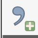, and set the remainder of the settings as follows, and click **Add & Close** to import the layer:    

| setting | value |
|--------------------------:|--------------------------------------------------------------------|
| File Format:  | CSV |
| Record and Field Options: | "First records has field names" = true "Detect field types" = true |
| Geometry Definition: | Point coordinates: "X field" = 'xcoord, "Y field" = 'ycoord' |
| Geometry CRS: | EPSG:4326 - WGS 84 |


  


### Layer symbology
Proportional symbols on Death Addresses

1. If not already, **click** on the **deathAddresses** layer to highlight it and focus the **Layer Styling panel** on this layer and use the following settings to adjust the **deathAddresses Symbology**:

| setting | value |
|------------------:|--------------------------------|
| Symbology Type:  | Graduated |
| Column: | Num_Cases |
| Symbol: | *click to change the color if you like* |
| Legend Precision: | 1 |
| Method: | Size |
| Size from: | 10,50,'Map Units' |
| Classes>Mode: | Equal Interval |
| Classes: | 3 |

Because QGIS now features live update of symbology changes you should see these changes apply as you change the setting values.  


#### Bonus: Adding Drop Shadows

1. At the bottom of the Layer Styling panel, look for the "Draw Effects" option and check it, then click  on the star that becomes active.
2. Check  the option for Drop Shadow and adjust the settings to see what effect they have.


### Viewing the Attribute Table

Up to this point we've been mostly concerned with building a new map project. Now we'd like to take a peek at some of the data behind the Map Canvas.

1. Right-click on the **deathAddresses** layer in the **Layers** panel and select **Open Attribute Table**.
2. Note that you can sort fields, scroll, select by attributes, etc...

### Statistics on a field  

As mentioned, above, the **Num_Cases** field in the Death Addresses data indicates the number of deaths at each address in the dataset. You can get a simple statistical snapshot of the variable from the Attribute Table.

1. Close the Attribute Table
2. On the pull-down menu go to **Vector > Analysis Tools > Basic Statistics for Fields**
3. On the window select **Death Addresses** as the Input Vector layer and **Num_Cases** as the Target field.
4. **Click Run** and **Close**
5. Look for the **Results Viewer** panel which should have been activated, and click on the **Hyperlink** to open the summary in a web browser.  
   

## Creating spatial data

### Finding a map

There are many venues for searching for old maps as sources for spatial data and I've listed a few of our favorites, below. Of course, there are many considerations of scale, authority, projections, etc... when using a scanned map as a data source, it is possible to scan and georeference just about any map you can find reference data (another map to georeference to) for.

* [earthworks.stanford.edu](earthworks.stanford.edu)
* [DavidRumsey.com](DavidRumsey.com)
* [OldMapsOnline.com](OldMapsOnline.com)

### Finding an already georeferenced map

We'll start by looking at this map [[Gegend von London 1853](https://www.davidrumsey.com/luna/servlet/detail/RUMSEY~8~1~298861~90066747:Gegend-von-London-1853?sort=Pub_List_No_InitialSort%2CPub_Date%2CPub_List_No%2CSeries_No&qvq=w4s:/where%2FLondon%2B%252528England%252529%2Fwhen%2F1854;q:london%201854;sort:Pub_List_No_InitialSort%2CPub_Date%2CPub_List_No%2CSeries_No;lc:RUMSEY~8~1&mi=1&trs=2)] of London on [https://davidrumsey.com](https://davidrumsey.com). It already has a "**Georeferenced** version, which can be viewed by clicking on the **Georeferencer** button at the top of the page.

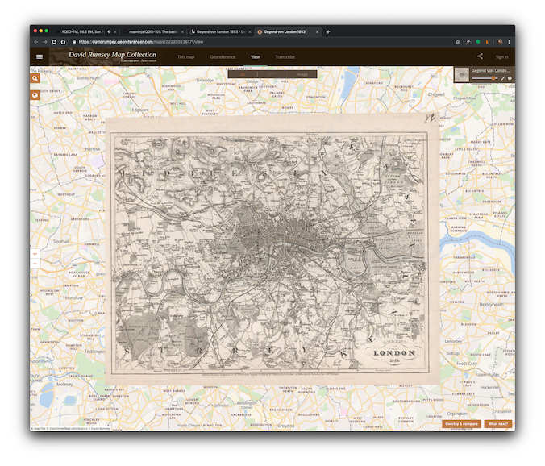

David Rumsey makes Open Geospatial Consortium (OGC) compliant services available for  georeferenced maps on his site. This means that you can use the maps directly in most modern GIS applications, including Arc GIS, QGIS, Arc  GIS Online, etc...

### Adding a DavidRumsey.com map to QGIS

Here is the **Web Map Tile Service WMTS URL** for the Gegend map:  

```http
https://maps.georeferencer.com/georeferences/435516159934/2019-02-19T17:27:12.514288Z/wmts?key=mpIMvCWIYHCcIzNaqUSo&SERVICE=WMTS&REQUEST=GetCapabilities
```

This URL provides access to the georeferenced map outside of the DavidRumsey.com website.

1. Select the WMTS URL, above, and copy it to your clipboard using right-click copy, or keyboard shortcuts, if you know them.  
2. On the Main Menu **Layer>Add Layer>Add WMS/WMTS Layer** to open the **Data Source Manager**
3. Click on the **New** button to open the **Create a New WMS/WMTS Connection** dialog:  

| Setting | Value |
|--------:|----------------------------------------------------------------------------------------------------------------------------------------------------------------------|
| Name: | Gegend Map |
| URL: | ```https://maps.georeferencer.com/georeferences/435516159934/2019-02-19T17:27:12.514288Z/wmts?key=mpIMvCWIYHCcIzNaqUSo&SERVICE=WMTS&REQUEST=GetCapabilities``` |   

   

4. Click OK to dismiss the dialog and save the connection  
5. Click **Connect**  
    

6. In the **Tilesets** tab, highlight the Gegend map WMTS layer item at the top and click **Add & Close** to close the dialog and return to the **QGIS Map Canvas**  
7. **Right-click** on the **Gegend von London 1853** layer in the **Layer panel** and select **Zoom to layer**  
8. Use the **Navigation Tools** to explore the map service at several different scales and extents.  

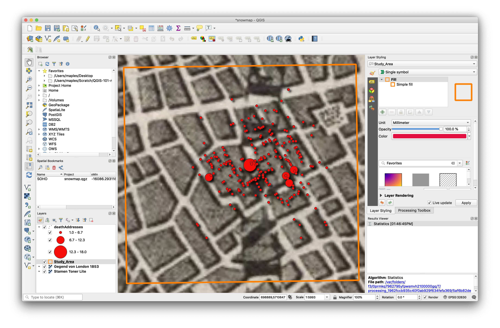

### Georeference a map  

Our goal in this workshop is to explore the cholera outbreak of 1854 and determine whether there is evidence that the Broad Street pump is the source of the outbreak. To do this we want to spatially allocate all of the death addresses in our data set to the water pump that they are nearest. Often the data that we need for our analysis doesn't exist in the format that we need it in. In this section we will use John Snow's original map of the 1854 cholera outbreak as a source for the locations of the water pumps in our analysis.

#### Setting up  

1. On the **Main Menu**, go to **Raster>Georeferencer** to open the **GDAL Georeferencer**
2. Click on the **Open Raster** button   and browse to the **/data/** folder, select the **snow_map.png** and click **Open**
3. Click on the  settings button 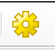  
4. Set the **Transformation Type**: "Polynomial 1"; **Resampling Method**:"Nearest Neighbor"; **Target SRS**: "Project CRS:EPSG:32630..."
5. Check the option to "**Save GCP points**" and "**Load in QGIS when done**"
6. Click OK to save the settings

#### Adding Ground Control Points

7. Use the Zoom tool to Zoom to the upper-right corner of the John Snow Map, around the SOHO Square
8. Click on the Add Point tool  and click on the upper right corner of the outside boundary of SOHO Square, as shown below:  
  

9. Click on the **From Map Canvas** button to switch back to the main QGIS Window
10. Zoom to the same area of your Map Canvas, *preferably using your mouse wheel or keyboard shortcuts so you don't deactivate the Add Point tool, but you can always go back to the Georeferencer window and reactivate it*
7. Place **Ground Control Points** in each corner of the map, switching between the two windows using the **Add Point** tool, as needed. Add a final point somewhere near the center of the map.


9. Click on the **Start Georeferencing** button  to start the georeferencing of your image and add it to the Map Canvas.
10. Close the Georeferencer and click OK if prompted to save your **GCP** points.

### Digitize features from a georeferenced map

Often, the reason we want to add a georeferenced map to our GIS layout is to digitize data from that map source. Here we will walk through the basic steps of preparing an empty dataset and digitizing features into it.

_Note:If the last section didn't go well, add the ```John_Snow_Map.tif``` from the **/backup_data/**_

1. On the **Main Menu**, go to **Layer>Create Layer** and select the **New Shapefile Layer...** option
2. Use the following settings:

| Setting | Value |
|-----------------------:|-----------------------------------|
| File name: | Save to /data/ as water_pumps.shp |
| File encoding: | system |
| Geometry type: | Point |
| Additional dimensions: | None |
| CRS: | EPSG:4326 - WGS 84 |

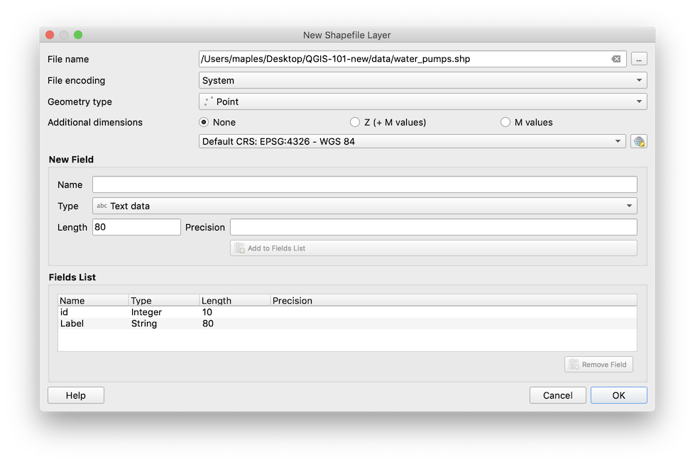

3. Add a New Field, add a **text  data** field called 'Label'
4. Click OK to create the empty shapefile and add it as a layer.

### Add points to your shapefile

Now we will begin adding features to our empty shapefile, as well as recording an attribute for each feature (the Label). To do this, we will need to "open the shapefile for editing" then save our edits, periodically.

1. Right-click on the **water_pumps layer** and select **Toggle Editing**
2. Click on the Add Point Feature button 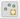and add a point for one of the Water Pumps in the John Snow map.
3. Label the point with the street it is on in the **Feature Attributes pop-up** and click ok to create the feature.

4. Continue digitizing Until you have captured all 13 water pumps in the map.
5. Right-click on the water_pumps layer and select **Toggle Editing**, saving your edits when you are prompted.

Your map should have a collection of 13 points like the image,  below:

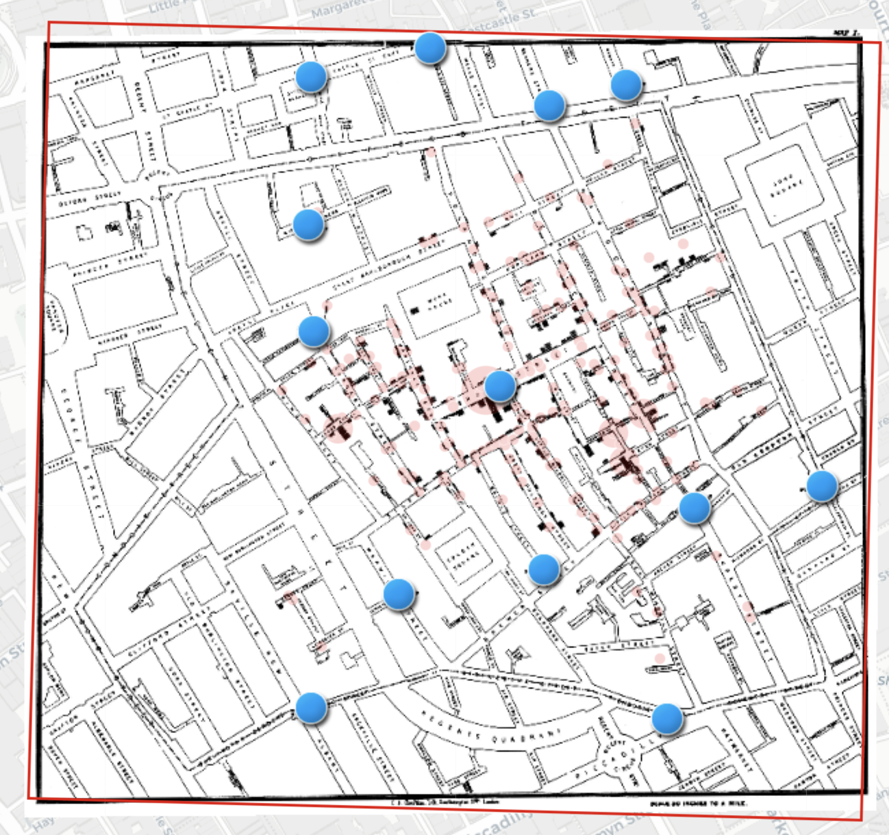

### Labels

1. Open the Layer Styling Panel, if it is not already
2. Click on the **water_pumps** layer to activate it in the **Layer Styling** panel
3. Click on the **Label** tab 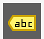 of the **Layer Styling** panel
4. Change the Label option to **Single labels**
5. Set **Label with:** to the 'label' field.
6. Increase the **Text Size** to **14**
7. Click on Buffer tab and enable the **Draw text buffer** option

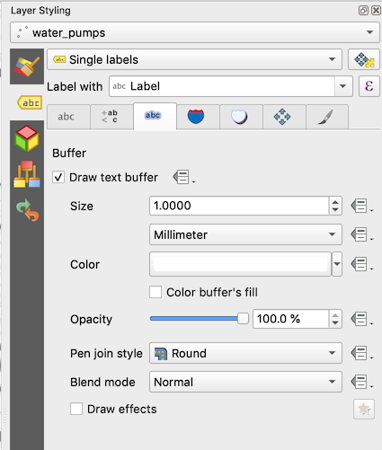

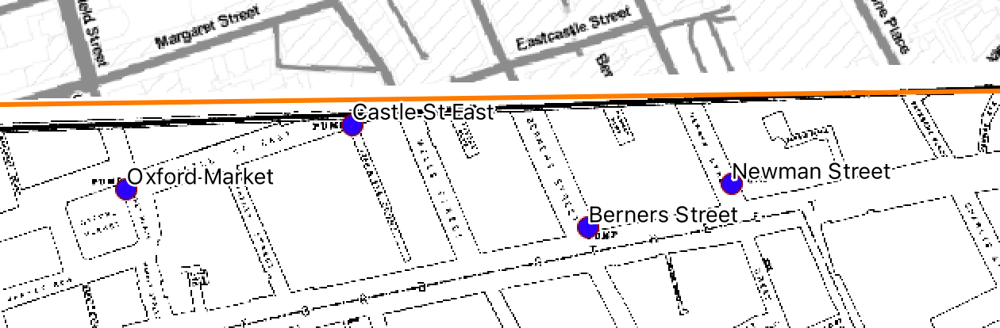


### Projecting data
Here, we will export our data to projected coordinate system of our project. Often, our data layers will need to be in the  projection  for many of the Processing Tools (in most Desktop GIS  systems, in fact) to  work properly. We'll use the same UTM coordiante system as our Study_Area.shp layer, for this  reason,  but also  because, in  general,it is far easier to measure and interpret the results of geometric operations  (area, length, perimeter, etc...).

1. Right-click on the water_pumps layer and select **Export>Save Features As...**
2. Save the layer as a Shapefile, named something like water_pump_projected.shp  and  use the CRS drop-down  to select the `Project CRS: EPSG32630 - WGS 84 / UTM zne 30N` as the Coordinate Reference System to project to, as the data is exported.
3. All other settings should be fine as defaults, so clik OK to export the new layer, which should be added to your Layers panel.

### Copying Symbologies
One of my favorite QGIS features is the ability to quickly copy and paste symology settings from one layer to another. Here we will quickly transfer the symbology we created for our original Water Pumps layer to our new projected  version.

1. Right click on the original **water_pumps layer** and select **Styles>Copy Styles> All Style Categories** (note that you can also be  selective about  what you copy!).
2. Right-click on the new water_pumps_projected layer and select **Styles>Paste Styles> All Style Categories**
3. Right-click on  your original water_pumps layer and select **Remove Layer**

You should now be left with an exact copy of your original water pummps layer, but with an appropriate projection for the next few steps of this  project.

## Basic spatial data analysis

### Voronoi (Thiessen) polygon (Spatial Allocation)

Thiessen polygons allocate space in an area of interest to a single feature per polygon. That is, within a Thiessen polygon, all other features are closer to the point that was used to generate that polygon than to any other point in the feature set. In this case, we will create a set of Thiessen polygons based upon the locations of the Water Pumps in our project. This will allow us to easily allocate all of the points in our death addresses dataset to the water pump that they are nearest using a simple spatial join.

1. On the Main Menu go to menu go to **Processing \> Toolbox**
2. Go to the **Processing Toolbox Window** and change the view from **Simplified Interface** to **Advanced Interface.**
3. Search for **Voronoi**
4. **Double–click** the **Voronoi polygons** tool
5. On the Voronoi tool select **water_pumps_projected** as the **Input layer.**  
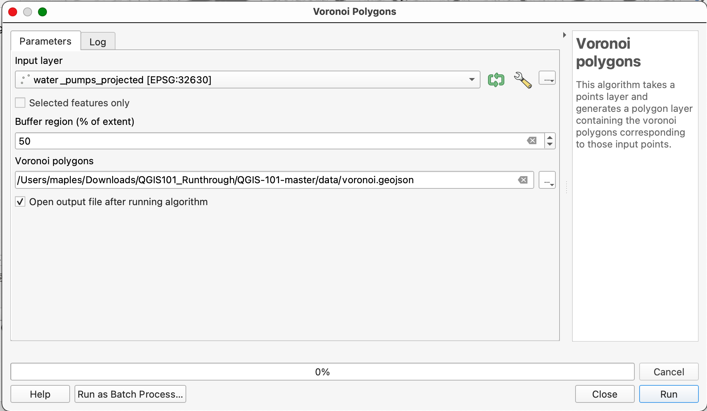

6. Set the **Buffer region** to **50%**
7. Browse and save teh  Voronoi polygons output as voronoi.geojson, changing the filetype to **GEOJSON files (*.geojson)** in the Save File dialog:
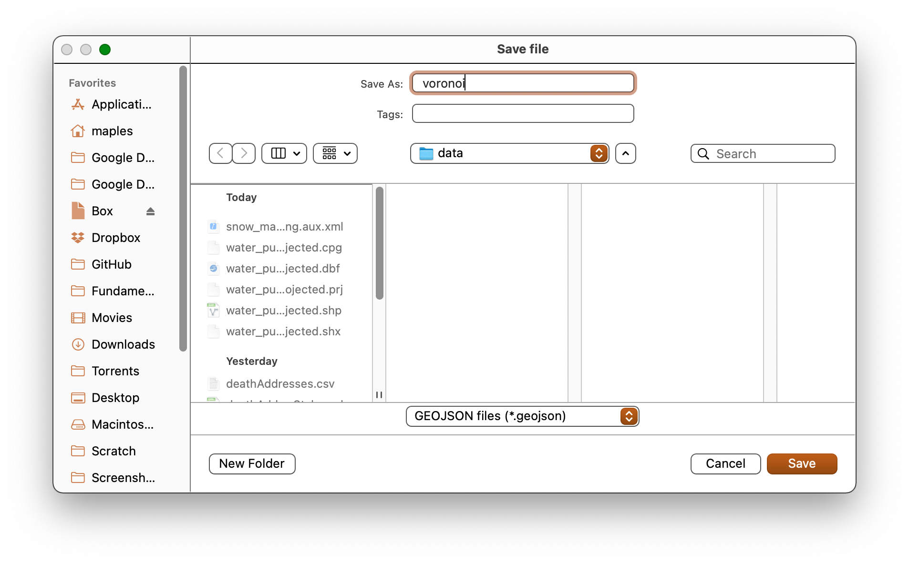

6. Click Run to create the voronoi polygon layer.
7. Drag the resulting layer below your water_pump_projected layer and adjust the symbology to be an outline, only, as shown.

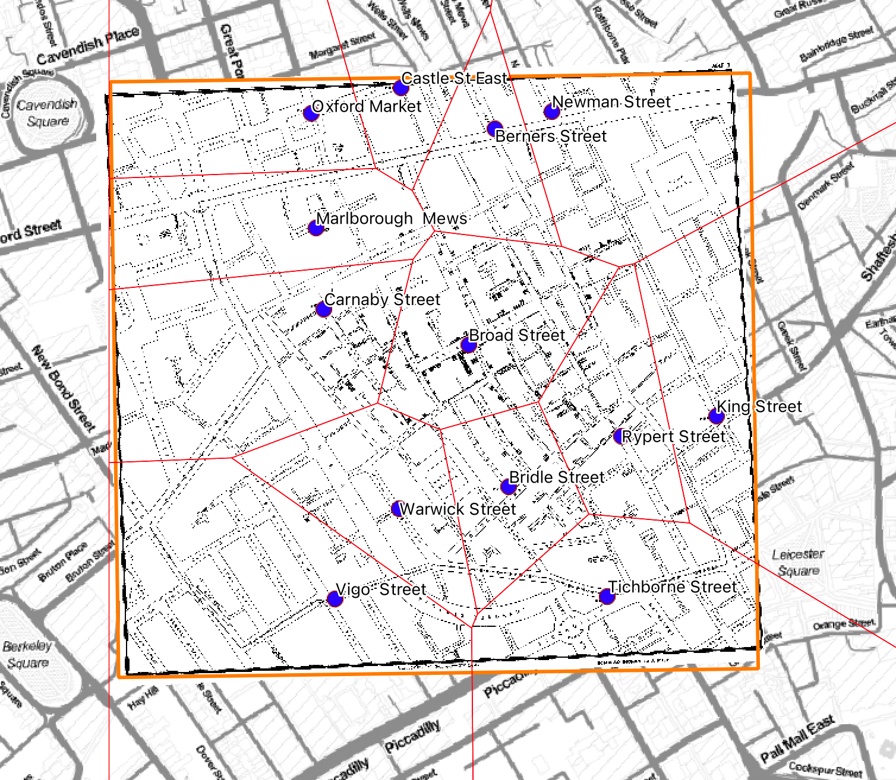

### Spatial Join (Point Aggregation)

Now that you have created the Voronoi polygon layer, you will “allocate” each of the deaths to one of the Voronoi polygons. To do this, we will use the **Join Attributes by Location** tool. Conceptually, what we will be doing is like passing our points through the polygons so that the polygon's attributes "stick" to the points.  

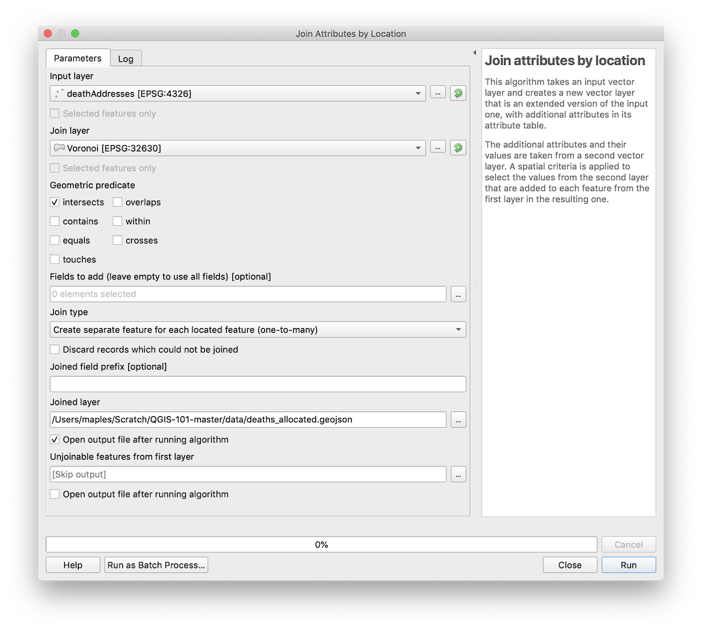

1. On the pull-down menu go to menu go to **Vector \> Data Management Tools \> Join attributes by location**

1.  Select **Death Addresses** as the Target vector layer and
    **Water_Pump_Voronoi** as the Join vector layer.

2.  **Click Browse** to save the output as a **Shapefile** and name it something like **Deaths_Allocated** in your **Data** Folder.

3.  **Click OK**

4.  Close the Join the attributes by location window.

5.  The resulting layer is added to the Map Canvas. **Open** its **attribute table** to confirm that the attributes of the Water Pumps have been transferred:  
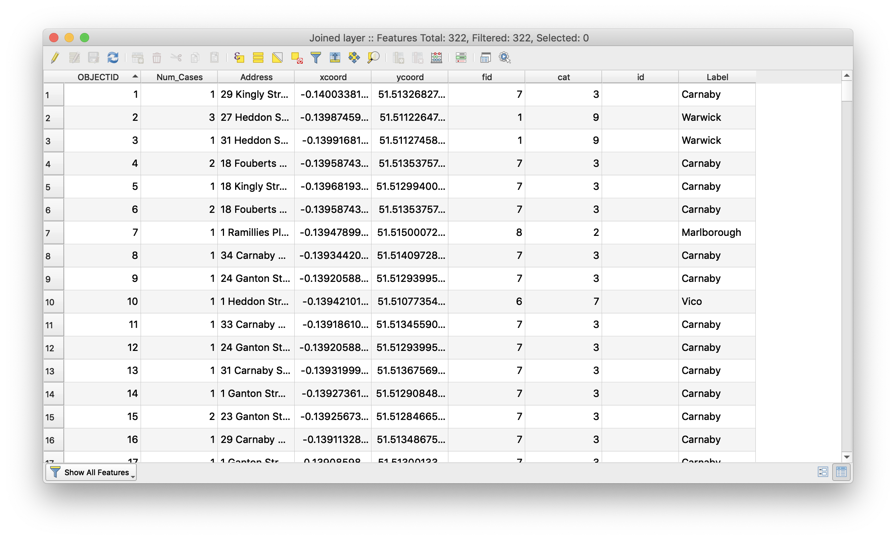

### Summary Statistics

Finally, we would like to summarize the deaths in the outbreak, grouping our summary by the name of the Water Pump that each Death Address is nearest. We will do this using the **Group Stats Tool** which allows us to do a statistical summary similar to the one we did earlier on the entire data set, but this time grouped by nearest water pump.


1.  On the pull-down menu go to **Plugins\> Manage and install plugins.**

2.  On the Plugins window search, type **Group Stats** and select it.

3.  Click on **Install plugin.**

4.  Close the **Plugin Window.**  
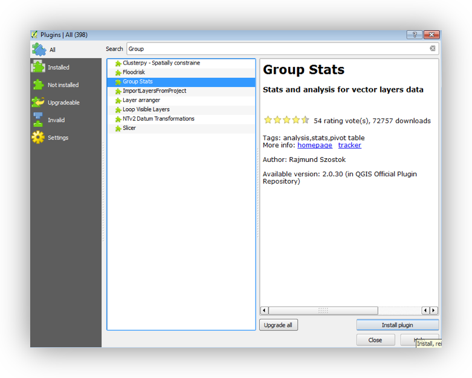


After the installation a **GroupStats Tool** 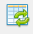 appears on the Vector Toolbar.

1. **Click** the **Group Stats tool**

2. **Select Deaths_Allocated** as Layer.  
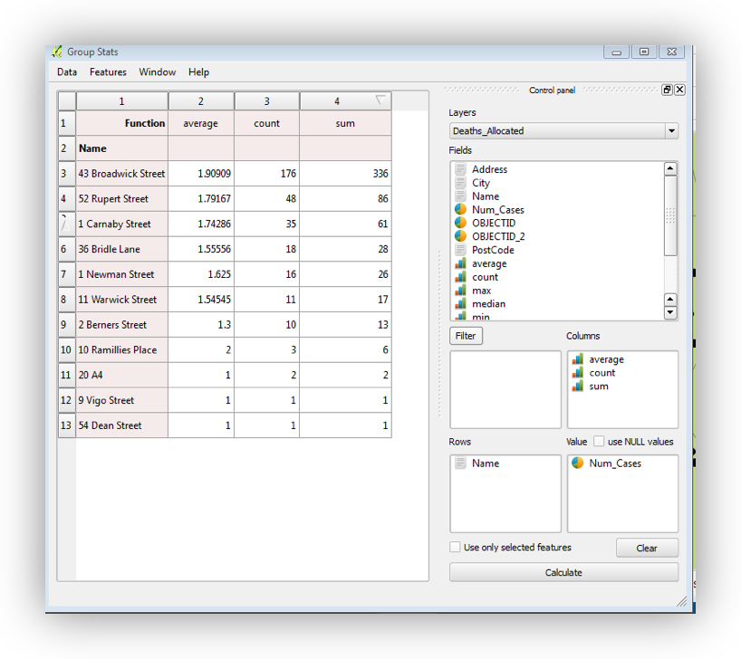

Drag from **Fields** to **Column**: average, count and sum.

On **Rows,** drag Name (originally from the Water_Pump data layer), and

on **Value** drag **Num_Cases.**

1.  **Click** on **Calculate** to visualize the summary table.

2.  **Click** the Sum field header on the resulting table to **Sort descending** on the **SUM\_Num\_Cases** field.

Note that the **Broadwick Pump** has the highest value for two of three
significant attributes: **Count** (No. of households), **Sum** (Total Deaths),
and **Average** (Mean Deaths per Household).

1.  On the **Group Stats Window,** go the **Data\> Save all to CSV file. Save** the **Ouput Table** to your **Data** Folder and name it **Deaths\_Summary\_by\_Pumps**.

2.  **Close** the Group Stats Window

## Basic Measures of Spatial Central Tendency

### Spatial Mean (Mean Center)

The Mean Center is the average x- and y-coordinate of all the features in the study area. It's useful for tracking changes in the distribution or for comparing the distributions of different types of features. Here, we will use the Mean Center to highlight the distribution of deaths around the Broad Street Pump.  

First, we will calculate a simple spatial mean. This is simply the mean center of the **distribution of locations**

1. On the pull-down menu go to menu go to **Vector \> Analysis \> Mean
coordinate(s)**  
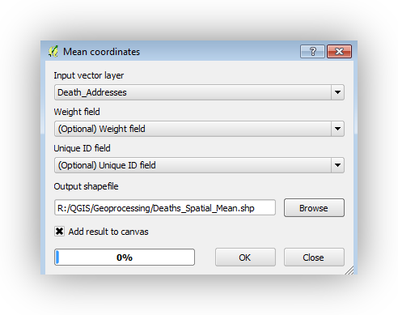  

1. Select **Deaths_Allocated** as the Input vector layer.
2. Leave the **Weight field** and **Unique ID field** as **Optional.**
3. **Click Browse** to **save** the Output Shapefile as:
    **Deaths\_Spatial\_Mean** to the **Data** Folder**.**
4. **Click OK** to calculate the **Mean Center** and **Close**.
5. Change the **Symbology** for the **Deaths\_Spatial\_Mean layer** to something that contrasts with the other symbologies.

### Weighted Spatial Mean

1. **Run** the **Mean Center tool** again, this time assigning the
   **Num_Cases** field as the **Weight Field**.
2. **Save** the **Output Shapefile** to the **Data** folder and name it **Deaths_Weighted_Spatial_Mean**.
3. **Apply a symbology** to the **Deaths_Weighted_Spatial_Mean layer**.

#### Bonus:  
Set the "Unique ID" option to the "label" field and observe the results. This has the effect of "casing" the spatial mean, based upon the spatial allocation that we did earlier.

### Standard Distance

The Standard Distance is the spatial statistics equivalent of the standard deviation. It describes the radius around the spatial mean (or weighted spatial mean), which contains 68% of locations in your dataset. It can be very useful for working with GPS data.

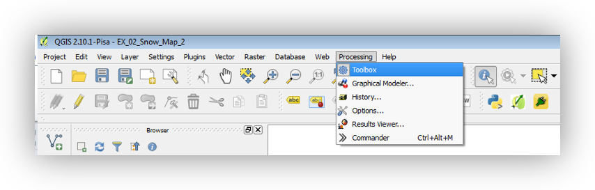

On the pull-down menu go to menu go to **Processing \> Toolbox** to open the
**Processing Toolbox Window.**

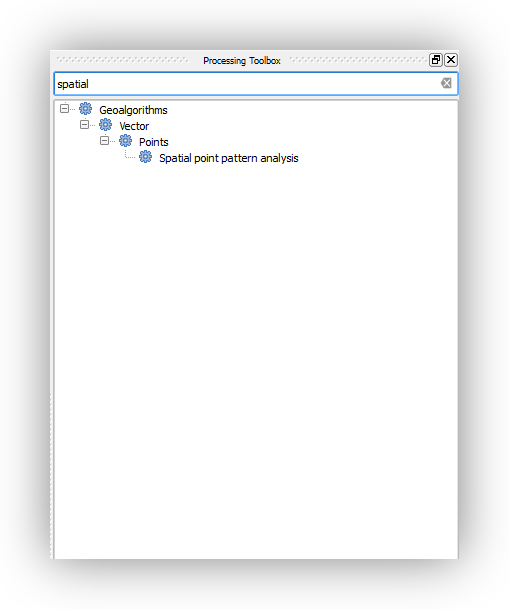

On the **Processing Toolbox Window type** to **search**: **Spatial point pattern
analysis** and **double click** to open the tool window.

1.  Select **Death Addresses** as the **Point** layer.

2.  Click the 3 dots and **Select** Save to a file.

3.  **Give** an appropriate name and **Save** the **3 Output Files** on your
    **Data** folder.

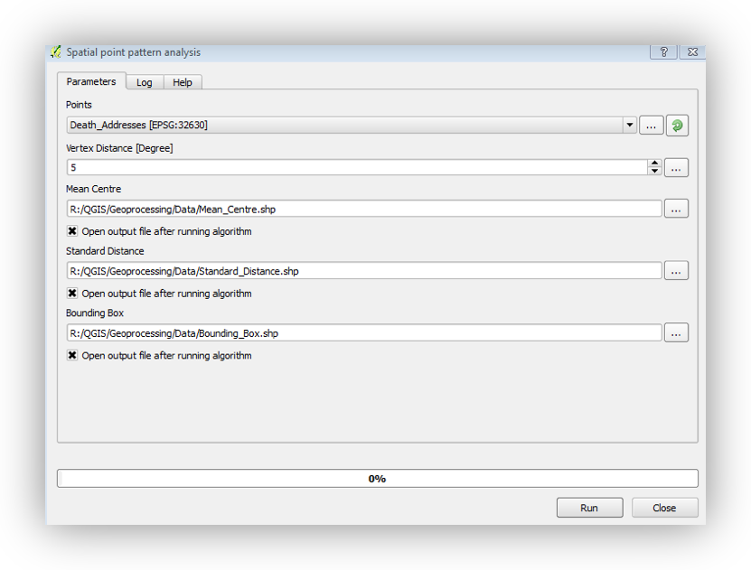

**Click Run** to calculate the **Standard Distance, Mean Centre and Bounding
Box.**

>   The red dot is the mean center (no weight field; the large circle is the
>   standard distance, which gives an indication of how closely the points are
>   distributed around the mean center; and the rectangle is the bounding box,
>   describing the smallest possible rectangle which will still enclose all the
>   points.

### Creating a surface from Point Data to Highlight “Hotspots”

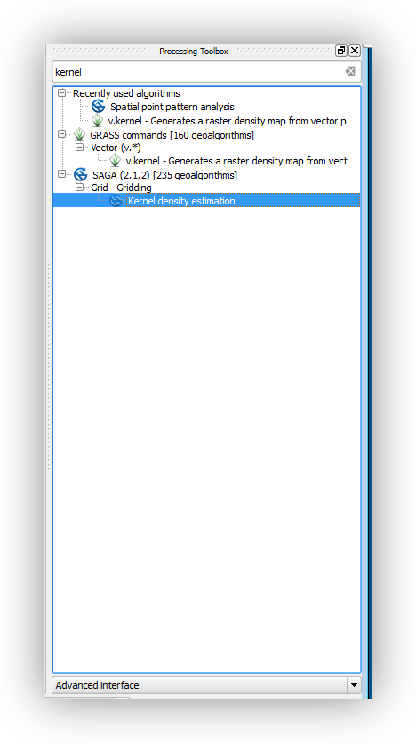

#### Kernel Density (Currently problematic)

The Kernel Density Tool calculates a magnitude per unit area from the point features using a kernel function to fit a smoothly tapered surface to each point. The result is a raster dataset which can reveal “hotspots” in the array of point data.

Note: Project your DeathAddresses data to the EPSG:32630 UTM coordinate system, before running the  next steps. Some changes have been made to the QGIS interface and how it interacts with some of the processing libraries included

1.  Go to the **Processing Toolbox Window** and **type** to search **Kernel Density Estimation (SAGA)** and **double click** to open the tool window.
2.  **Select** the **Deaths_Allocated** layer as the **Points** features.
3.  Select **Num_Cases** as the **Weight Field.**
4.  Set the **Radius** option to **50** (this is in meters).
5.  On the **Output Extent** option, click the 3 dots and select **Use
    layer/canvas extent.**
6.  On the resulting window search for **Study Area** and **Click OK.**
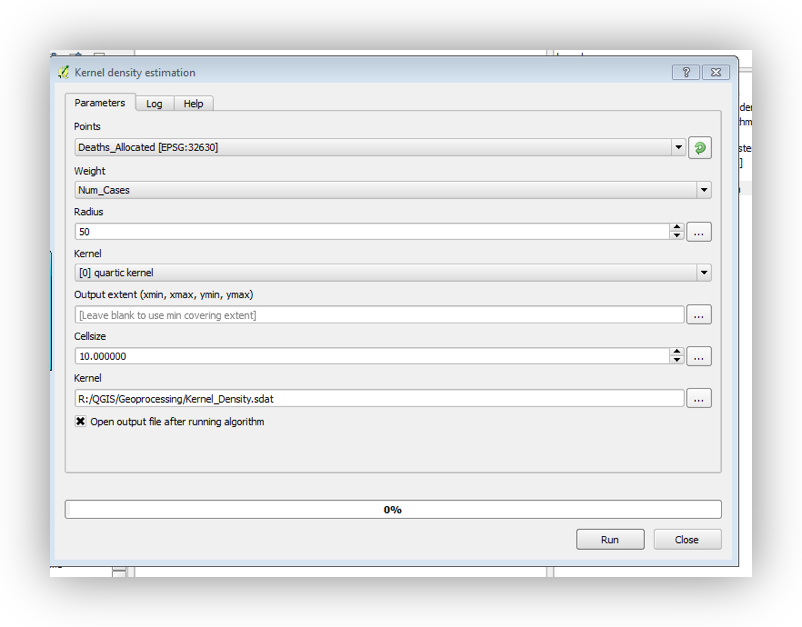

Set the **Cellsize** to 10 (this is also in meters)

1.  On the **Kernel Option click** the 3 dots and select **Save to File.**

2.  **Save** the **Output Raster** to the **Data Folder** as **Kernel_Density.**

3.  **Click Run** to run the Kernel Density tool.

4.  **Right Click** the **Kernel_Density layer** and **open** its
    **properties**.

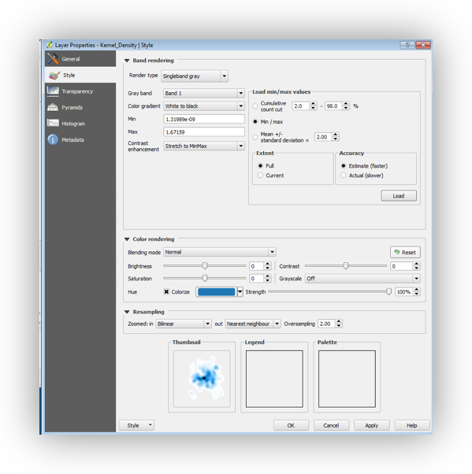

**Go** to the **Style Tab** and select

1.  **Render Type:** Singleband gray

    1.  **Color Gradient:** White to black

    2.  **Contrast enhancement:** Stretch to MinMax.

    3.  **Load min/max values:** Select min/max and click load.

    4.  **Hue:** Check Colorize and select a color of your choice

    5.  **Resampling:** Zoomed in **Bilinear.**

    6.  **Click OK**


That's all for now!

For more on QGIS Cartography and creating layouts, particularly for journal publication see David's QGIS Cartography workshops:

https://sites.google.com/stanford.edu/gis-cartography/workshops/qgis-cartography

https://sites.google.com/stanford.edu/gis-cartography/workshops/maps-for-academic-journals
